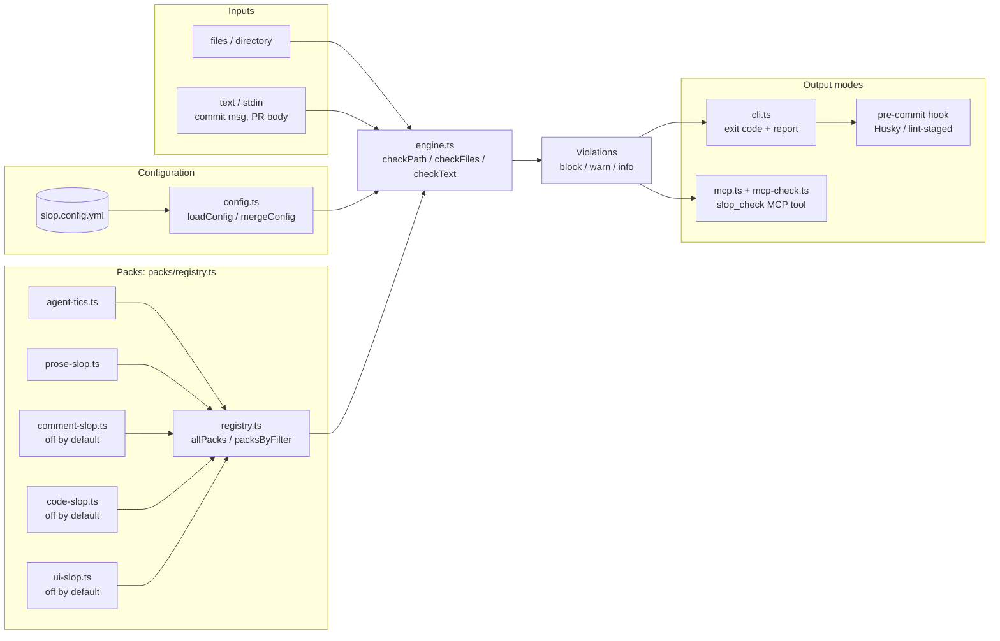

# agent-dx

**[`slop-detector`](packages/slop-detector) is the AI-slop linter for PRs.** It catches the visible tells of agent-generated content: leaked tool-call XML, doubled `## Summary` headings, hedging openers, marketing adjectives, JSDoc on trivial getters, `try/catch` around code that cannot throw. This repo is its home, plus the toolkit that grew up around it.

> Most agent tooling helps a model *write* the code. `slop-detector` keeps what shipped from looking like an AI wrote it. The siblings in this monorepo (scaffolds, entrypoint generators, release helpers) are the workbench it grew on.

## Try slop-detector in 60 seconds

```bash
git clone https://github.com/LanNguyenSi/agent-dx && cd agent-dx
cd packages/slop-detector && npm install && npm run build && cd ../..

# Scan a deliberately-sloppy markdown sample
node packages/slop-detector/dist/cli.js check examples/slop-sample.md --explain
```

Thirty-four deterministic rules across five packs:

| Pack | Default | What it catches |
|------|---------|-----------------|
| `agent-tics` (7 rules) | on | leaked `</result>` / `</invoke>` tags, auto-appended Claude Code footers, doubled Summary headings, template TODO placeholders |
| `prose-slop` (7 rules) | on | em-dashes, hedging openers, marketing adjectives, signature LLM idioms (`delve into`, `tapestry of`, `leverage the power of`) |
| `comment-slop` (5 rules) | off, opt in via `--pack` | JSDoc on trivial getters, comments that restate the next line, orphan markers, ASCII banner dividers |
| `code-slop` (9 rules) | off, opt in via `--pack` | `try/catch` around non-throwing code, defaults on required-typed params, empty / rethrow catches, `async` without `await`, backcompat shims for unreleased APIs, phantom imports of undeclared packages, stub function bodies, unused exports, single-callsite helpers |
| `ui-slop` (6 rules) | off, opt in via `--pack` | gradient text, purple+cyan AI palettes, animated layout properties, skipped heading levels, plus opt-in monospace-everywhere and flat type hierarchy (info-level). Scans CSS / SCSS / LESS / HTML / JSX. |

The three opt-in packs (`comment-slop`, `code-slop`, `ui-slop`) are off by default because their false-positive surface in mixed codebases is wider; opt in with `--pack <id>` or set `packs.<id>: true` in `slop.config.yml`.

Configurable per repo via `slop.config.yml`, with per-line escape hatches when a real em-dash or template `<invoke>` block is wanted. Husky and lint-staged recipes in [`packages/slop-detector/README.md`](packages/slop-detector).

## What a run looks like

```
examples/slop-sample.md
  WARN  3:1    prose-slop/hedging-opener     Hedging opener `It is important to note that`
  WARN  3:40   prose-slop/marketing-adjectives  Empty marketing adjective `cutting-edge`
  WARN  3:121  prose-slop/delve-tapestry     LLM idiom `leverage the power of`
  WARN  7:42   prose-slop/delve-tapestry     LLM idiom `delve into`
  WARN  12:42  prose-slop/em-dash            Em-dash in prose
  WARN  15:1   agent-tics/doubled-summary-heading  Second `Summary` heading
  WARN  19:1   agent-tics/placeholder-todo   Unresolved template placeholder
  WARN  21:1   agent-tics/claude-code-footer Auto-appended Claude Code attribution footer
  ... 12 more

1 files scanned, 20 violations (block 0, warn 20, info 0)
```

`--explain` adds a one-line rationale per violation. Promote any rule to `block` per repo via `slop.config.yml`; the two `agent-tics` rules that catch leaked tool-call XML wrappers (`</result>`, `</invoke>`) ship as `block` by default since those are objectively wrong.

## Scan pipeline

The scan pipeline shows how slop-detector routes input through config and pack selection into the rule engine, then fans out to the three output surfaces.



## Why this exists

LLMs leave fingerprints. Some are objectively wrong, like leaked `</result>` artefacts from MCP serialisation. Others are stylistic tics the team has already decided to avoid: em-dashes in prose, `It is important to note` openers, empty marketing adjectives, doubled `## Summary` blocks. None are caught by tests, typecheck, or human reviewers under load. They accumulate.

Concrete data point: when `slop-detector` ran for the first time against the bodies of the 20 most recent merged PRs across LanNguyenSi/, it found 38 real violations (27 em-dashes, 11 auto-appended Claude Code footers) across 13 of the 20 PRs. Zero false positives. Every one of those PRs had been written by an agent, reviewed, and merged before the linter existed. The tool's first run was a quiet receipt.

The pitch: lint at commit time, not at "I noticed three months later". `slop-detector` runs in pre-commit, in CI as a status check, or ad-hoc against a path. It is not yet published to npm (the bare `slop-detector` name there is an unrelated third-party package), so run it from a local build: see the [package README](packages/slop-detector/README.md#install).

## Other tools in the workshop

These were built alongside `slop-detector` for the same human-and-agent workflow. Each stands alone, none is the headline.

| Package | What it does |
|---------|--------------|
| [agent-dev-kit](packages/agent-dev-kit) | CLI scaffolding for AI agent projects: file layout, hooks, entrypoints. |
| [orchestrator-workflow](packages/orchestrator-workflow) | Installer for an orchestrator-led agent workflow: `.ai/` run state, an `AGENTS.md` policy section, and subagent definitions with preselected models for Claude Code, Codex, and opencode. |
| [agent-entrypoint](packages/agent-entrypoint) | Generate and validate `AGENT_ENTRYPOINT.yaml` so an agent can find its way into a repo without prompting tricks. |
| [friction-log](packages/friction-log) | Capture, query, and infer agent-workflow frictions. SQLite-backed, sink-pluggable, zero-config default. v1 surface: `log`, `list`, `search`, `digest`, `export`, `file`, `scan`, `bilanz`, plus `init`/`import`/`rm`/`update`. |
| [release-prep](packages/release-prep) | Changelog from conventional commits, semver bump suggestions, annotated tags, GitHub releases. |
| [github-api-tool](packages/github-api-tool) | TypeScript CLI for GitHub API operations (issues, PRs, commits, standup digests), JSON output for agents calling via `exec`. |
| [git-batch-cli](packages/git-batch-cli) | Run safe batch git operations across all repos under a folder: sync, status, dirty checks, fetch, with `--strict` for automation. |
| [agent-engineering-playbook](packages/agent-engineering-playbook) | Guide for building production-ready AI agent systems. |
| [agentic-coding-playbook](packages/agentic-coding-playbook) | Practical playbook for teams using AI agents in coding. |

## Repo layout

`agent-dx` is a folder of independent packages, not an npm workspaces / pnpm / lerna monorepo. There is no root `package.json`, no workspace manifest, and no shared root `node_modules`. Each package under `packages/` carries its own `package.json`, install, build, test, and version, so the install pattern for any of them is the same one shown above for `slop-detector`:

```bash
cd packages/<name> && npm install && npm run build
```

If you only care about one package, work in its directory; nothing at the root needs to be set up first.

## Status

Experimental: each package has its own version, README, and CI. APIs may evolve at minor-version bumps. `slop-detector` is the most polished and the only one with active distribution intent (npm, hooks, planned GitHub Action).

## Where this fits

`slop-detector` and the workshop around it contribute the authoring-side tooling to the [Project OS](https://github.com/LanNguyenSi/project-pilot) human-agent dev lifecycle. It sits alongside:

- [agent-planforge](https://github.com/LanNguyenSi/agent-planforge) plans
- [agent-tasks](https://github.com/LanNguyenSi/agent-tasks) coordinates
- [agent-grounding](https://github.com/LanNguyenSi/agent-grounding) verifies (evidence ledger, claim gate, hypothesis tracker)
- [agent-preflight](https://github.com/LanNguyenSi/agent-preflight) gates pushes
- [harness](https://github.com/LanNguyenSi/harness) declares + enforces the policy boundary that calls into all of the above

[scaffoldkit](https://github.com/LanNguyenSi/scaffoldkit) and [agent-planforge](https://github.com/LanNguyenSi/agent-planforge) are standalone tools used by [project-forge](https://github.com/LanNguyenSi/project-forge).
