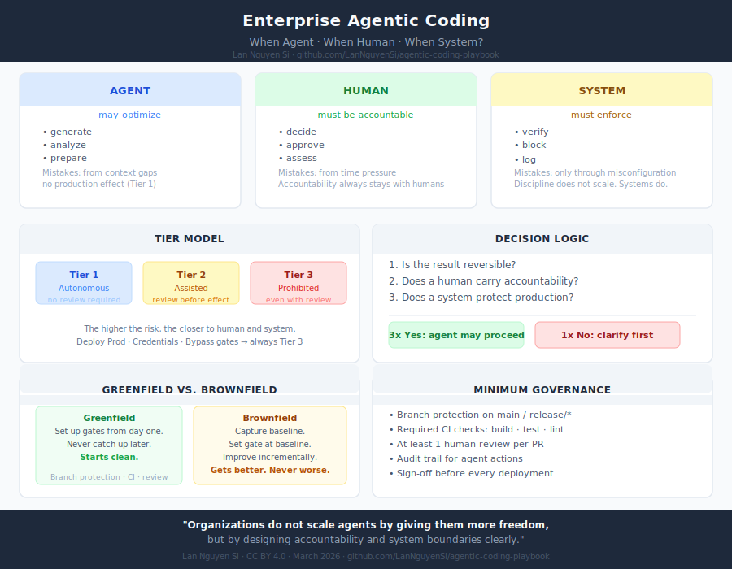

# Agentic Coding Playbook

**A practical playbook for teams: when to use AI agents, when humans should stay in the loop, and how to make agentic coding safer and more accountable.**

*Lan Nguyen Si | CC BY 4.0*

## Core thesis

**Agents may optimize. Humans must remain accountable. Systems must enforce the difference.**

This package focuses on the human and organizational side of agentic coding:

- when to use agents
- when not to use agents
- what kinds of review are needed
- how to reduce operational and quality risk

## Main playbooks

**[PLAYBOOK-EN.md](PLAYBOOK-EN.md)** — Executive playbook (English)

**[PLAYBOOK.md](PLAYBOOK.md)** — Executive playbook (Deutsch)

## One-page overview

**English:** 

**Deutsch:** 

## Additional reference material

For teams that want a clearer model for review depth and implementation quality:

- [Review Levels and Implementation Standards (English)](references/review-levels-and-implementation-standards.md)
- [Review-Stufen und Qualitätsstandards (Deutsch)](references/review-stufen-und-qualitaetsstandards.md)
- [Implementation Agent Standard (English)](standards/implementation-agent-standard.md)
- [Implementierungs-Agent-Standard (Deutsch)](standards/implementierungs-agent-standard.md)

These companion documents describe the difference between no review, normal review, and rigorous review, and propose a practical `Role + Skill + Standard` model for implementation agents.

## Related projects

- **[agent-engineering-playbook](https://github.com/LanNguyenSi/agent-engineering-playbook)** — Full technical reference with checklists and templates
- **[project-forge](https://github.com/LanNguyenSi/project-forge)** — Greenfield scaffolding with built-in gates
- **[depsight](https://github.com/LanNguyenSi/depsight)** — Security and dependency health for brownfield

## Contributing

This is a living document. Feedback, corrections and additions are welcome via Issues and Pull Requests.

**License:** CC BY 4.0
