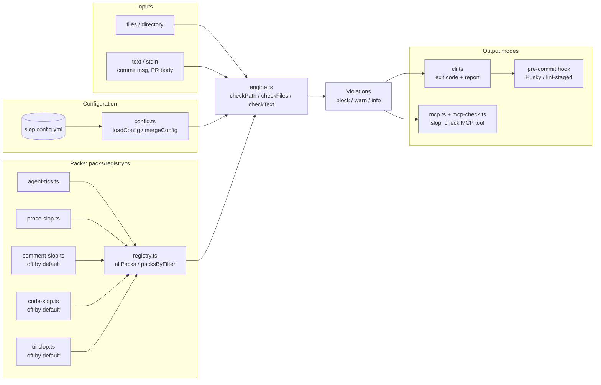

# slop-detector

Configurable AI-slop linter for PRs and committed content. Catches the recognisable tells of agent-generated text: leaked tool-call XML wrappers, em-dashes in user-facing prose, hedging openers, marketing adjectives, doubled summary headings.

Part of [agent-dx](https://github.com/LanNguyenSi/agent-dx), playbooks and tooling for teams shipping with AI agents.

## Why

Agents leave fingerprints. Some are objectively wrong, like leaked `</result>` artefacts from MCP serialisation. Others are stylistic tells the team has already decided to avoid: em-dashes in prose, `It is important to note` openers, empty marketing adjectives, doubled `## Summary` blocks. None are caught by tests, typecheck, or human reviewers under load. They accumulate.

Concrete data point: when `slop-detector` ran for the first time against the bodies of the 20 most recent merged PRs across LanNguyenSi/, it found 38 real violations (27 em-dashes, 11 auto-appended Claude Code footers) across 13 of the 20 PRs. Zero false positives. Every one of those PRs had been written by an agent, reviewed, and merged before the linter existed. The tool's first run was a quiet receipt.

This package turns those rules into a deterministic linter you can run in pre-commit, in CI, or against a directory tree: lint at commit time, not at "I noticed three months later."

## Install

slop-detector is not yet published to npm (the bare `slop-detector` name is an unrelated third-party package), so run it from a local build of this monorepo:

```bash
git clone https://github.com/LanNguyenSi/agent-dx
cd agent-dx
cd packages/slop-detector && npm install && npm run build && cd ../..

# alias the local CLI for this shell; the examples below use the bare `slop-detector` command
alias slop-detector="node $PWD/packages/slop-detector/dist/cli.js"
```

Without the alias, invoke the built CLI directly: `node packages/slop-detector/dist/cli.js check README.md`.

## Quick start

```bash
# scan a path (file or directory)
slop-detector check packages/

# scan stdin (use in pre-commit pipes)
git diff --cached --name-only | xargs cat | slop-detector check --stdin-path PR_BODY.md

# only run a specific pack
slop-detector check . --pack agent-tics

# see why a rule fires
slop-detector check . --explain

# JSON output for tooling
slop-detector check . --format json
```

## Rule packs

Each pack groups related rules. Enable or disable per repo via `slop.config.yml`.

| Pack | Default | Catches |
|------|---------|---------|
| `agent-tics` (7 rules) | on | Stray `</result>` / `</invoke>` tags, auto-appended Claude Code footers, doubled Summary headings, template TODO placeholders |
| `prose-slop` (7 rules) | on | Em-dashes in prose, hedging openers, empty marketing adjectives, signature LLM idioms like `delve into`, `tapestry of`, `leverage the power of` |
| `comment-slop` (5 rules) | off, opt in via `--pack` | JSDoc on trivial getters, comments that restate the next line, orphan markers (`// removed`, `// kept for backcompat`), comment-heavier-than-body helpers, ASCII banner dividers |
| `code-slop` (9 rules) | off, opt in via `--pack` | try/catch around code that cannot throw, defaults on required-typed params, empty / rethrow catches, `async` without `await`, backcompat shims for unreleased APIs, phantom imports of undeclared packages, stub function bodies, unused exports, single-callsite helpers |
| `ui-slop` (6 rules) | off, opt in via `--pack ui-slop` | Gradient text, purple+cyan AI palettes, animated layout properties, skipped heading levels, plus opt-in monospace-everywhere and flat type hierarchy (info-level). Scans CSS / SCSS / LESS / HTML / JSX. |

The three opt-in packs (`comment-slop`, `code-slop`, `ui-slop`) are off by default because their false-positive surface in mixed codebases is wider; opt in with `--pack <id>` or set `packs.<id>: true` in `slop.config.yml`.

Run `slop-detector list-rules` for the full rule catalogue with severities and rationales.

### `ui-slop` (M3 v1) by example

Opt in with `--pack ui-slop`. Examples that trip the four default-on rules:

```css
/* ui-slop/gradient-text */
.headline {
  background: linear-gradient(90deg, #7c3aed, #06b6d4);
  -webkit-background-clip: text;
  color: transparent;
}

/* ui-slop/ai-color-palette */
.hero {
  background: radial-gradient(circle, hsl(270, 70%, 50%), hsl(185, 80%, 50%));
}

/* ui-slop/animate-layout-properties */
@keyframes grow {
  from { width: 100px; }
  to   { width: 200px; }
}
.panel { transition: height 0.3s ease; }
```

```html
<!-- ui-slop/skipped-heading-levels -->
<section>
  <h1>Title</h1>
  <h3>Subtitle</h3>   <!-- skipped h2 -->
</section>
```

The two off-by-default info rules (`ui-slop/monospace-everywhere`, `ui-slop/flat-type-hierarchy`) need an explicit `rules.<id>.enabled: true` in `slop.config.yml` or a CLI override; they remain off because both have legitimate counter-uses (technical-product landing pages, mature design systems with subtle steps).

Known v1 limitations (tracked as M3 follow-ups):
- Tailwind class strings like `bg-gradient-to-r from-purple-500 to-cyan-500` are not detected; only literal CSS / hex / hsl in style declarations.
- JSX inline `style={{ background: 'linear-gradient(...)' }}` literals are not scanned for rules 1-3 (only `ui-slop/skipped-heading-levels` walks JSX).
- Vue / Svelte single-file-component `<style>` blocks are detected as `markup`, so CSS-shape rules don't fire on them; extract the styles or scope a separate `.css` file.
- `@media`-wrapped top-level selectors are not walked recursively by `ui-slop/monospace-everywhere`.
- `transition: all` is flagged, but `animation: <name>` referencing a `@keyframes` outside the same file is not cross-resolved.

## What a run looks like

```
examples/slop-sample.md
  WARN  3:1    prose-slop/hedging-opener     Hedging opener `It is important to note that`
  WARN  3:40   prose-slop/marketing-adjectives  Empty marketing adjective `cutting-edge`
  WARN  3:121  prose-slop/delve-tapestry     LLM idiom `leverage the power of`
  WARN  7:42   prose-slop/delve-tapestry     LLM idiom `delve into`
  WARN  12:42  prose-slop/em-dash            Em-dash in prose
  WARN  15:1   agent-tics/doubled-summary-heading  Second `Summary` heading
  WARN  19:1   agent-tics/placeholder-todo   Unresolved template placeholder
  WARN  21:1   agent-tics/claude-code-footer Auto-appended Claude Code attribution footer
  ... 12 more

1 files scanned, 20 violations (block 0, warn 20, info 0)
```

`--explain` adds a one-line rationale per violation. Promote any rule to `block` per repo via `slop.config.yml`; the two `agent-tics` rules that catch leaked tool-call XML wrappers (`</result>`, `</invoke>`) ship as `block` by default since those are objectively wrong.

## Scan pipeline

The scan pipeline shows how slop-detector routes input through config and pack selection into the rule engine, then fans out to the three output surfaces.



## Severity model

Each rule has a default severity:

- `block`: exits non-zero in CLI, fails pre-commit / CI checks. Reserved for objectively-wrong patterns (stray XML tags).
- `warn`: surfaced but does not fail. Default for stylistic rules.
- `info`: listed but treated as advisory. Used for rules that have legitimate counter-examples.

Promote any rule to `block` (or downgrade to `info`) per repo:

```yaml
# slop.config.yml
rules:
  prose-slop/em-dash:
    severity: block
  agent-tics/claude-code-footer:
    enabled: false
```

## Configuration

```yaml
# slop.config.yml
packs:
  agent-tics: true
  prose-slop: true
  comment-slop: false

rules:
  prose-slop/em-dash:
    severity: block
  prose-slop/redundant-note:
    enabled: true

ignorePaths:
  - "**/vendor/**"
  - "docs/legal/**"

treatAsProse:
  - "**/CHANGELOG.md"
  - "**/templates/*.txt"

treatAsCode:
  - "**/Dockerfile.*"
```

Defaults applied even without a config: `agent-tics` and `prose-slop` packs on; `comment-slop`, `code-slop`, `ui-slop` off; ignores cover `node_modules`, `dist`, `build`, `coverage`, `.git`, lockfiles.

## Cross-file rules (experimental)

Two `code-slop` rules analyse symbols across all files in the scan root rather than per file.  They are **off by default** and require a corpus pre-pass that parses every TypeScript/JavaScript file once before the rule loop runs.

| Rule | Default severity | What it finds |
|------|-----------------|---------------|
| `code-slop/unused-export` | warn | Exported symbols not imported by any other file and not reachable via `package.json` entrypoints (`main`, `bin`, `exports`). |
| `code-slop/single-callsite-helper` | warn | Named functions/`const`s with a body of at most 3 statements that are called from at most one place in the package (candidates for inlining). |

### Enabling the corpus pre-pass

Three equivalent switches, use whichever fits your workflow:

**Environment variable** (one-off or CI step):
```sh
SLOP_CORPUS=1 slop-detector check src/
```

**Config file** (`slop.config.yml`):
```yaml
corpus: true
```

**Programmatic API** (`CheckOptions`):
```ts
import { checkFiles } from "slop-detector";
checkFiles(files, { packs, config, corpusEnabled: true });
```

### Opting individual rules in

Because both rules are `enabledByDefault: false` you must also enable them via `ruleOverrides`:

```yaml
# slop.config.yml
corpus: true          # enable the pre-pass

rules:
  code-slop/unused-export:
    enabled: true
  code-slop/single-callsite-helper:
    enabled: true
```

### Known limitations (v1)

- **Entrypoint resolution uses dist paths.** `package.json` `main`/`exports` fields typically point at compiled output (`dist/index.js`).  When you scan `src/`, the entrypoint files are not matched and every symbol in the public API entry file will appear as an unused export.  Workaround: add the entry file to `ignorePaths`, or scope the scan to a sub-directory that does not contain the public API boundary.  A symbol-level entrypoint glob is tracked as a follow-up.
- **Name-only symbol matching.** The corpus matches symbols by identifier name across files, not by import binding.  Two unrelated exports with the same name in different files will be counted as references to each other (false negative on `unused-export`).  Likewise, a local variable shadowing an imported name may suppress a violation (false positive suppression).
- **Each file is parsed twice** when both the corpus pre-pass and the per-file rule loop run: once in `buildCorpus` and once inside the rule `check()` call (the second parse is cache-hit via `parseTsFile`'s `WeakMap`, so no disk I/O, but the AST walk repeats).

## Per-line opt-out

Disable on a single line:

```md
This sentence has a deliberate em-dash — and it stays. <!-- slop-detector:disable-line=prose-slop/em-dash -->
```

Or scope by pack:

```md
<!-- slop-detector:disable-next-line=agent-tics -->
</result> a real example for the docs
```

`slop-detector:disable-line` and `slop-detector:disable-next-line` accept either a rule id, a pack id, or no argument (disables every rule on that line).

## Pre-commit recipe (Husky)

```jsonc
// package.json
{
  "scripts": {
    "slop": "slop-detector check ."
  },
  "husky": {
    "hooks": {
      "pre-commit": "npm run slop"
    }
  }
}
```

For a faster, staged-files-only variant pair with [lint-staged](https://github.com/okonet/lint-staged):

```jsonc
{
  "lint-staged": {
    "*.md": "slop-detector check"
  }
}
```

## CI usage

```yaml
- name: Slop check
  run: |
    (cd packages/slop-detector && npm install && npm run build)
    node packages/slop-detector/dist/cli.js check . --format json > slop-report.json
```

A dedicated GitHub Action with PR annotations is planned for M3.

## MCP server

slop-detector also ships a stdio [MCP](https://modelcontextprotocol.io) server (`bin`: `slop-detector-mcp`, entry point `dist/mcp.js`), so an agent can scan commit messages, PR bodies, and files as a native tool call instead of shelling out to the CLI.

It exposes one tool, `slop_check`:

| Param | Type | Notes |
|-------|------|-------|
| `text` | string | In-memory string to scan. Mutually exclusive with `path`. |
| `path` | string | File or directory to scan. Mutually exclusive with `text`. |
| `filename` | string | Filename assumed for `text` input (prose-vs-code detection). |
| `packs` | string[] | Restrict to these packs; off-by-default packs only run when named. |
| `configPath` | string | Path to a `slop.config.yml` / `.json`. |

It returns each violation as `SEVERITY line:col rule message`, grouped by file, plus a one-line tally.

Register it with your runtime by pointing at the built entry point:

```json
{
  "mcpServers": {
    "slop-detector": {
      "command": "node",
      "args": ["/absolute/path/to/slop-detector/dist/mcp.js"]
    }
  }
}
```

Run `npm run build` first so `dist/mcp.js` exists.

## Exit codes

| Code | Meaning |
|------|---------|
| 0 | No `block`-severity violations. `warn` and `info` are reported but do not fail the run. |
| 1 | At least one `block`-severity violation. |
| 2 | CLI invocation error (missing config, unreadable path). |

## Roadmap

- M1: `agent-tics` + `prose-slop` packs, CLI, config loader, per-line disables.
- M2: `comment-slop` + `code-slop` packs (TypeScript AST via `@typescript-eslint/parser`). Both off by default; opt in via config or `--pack`. Within-file analysis only for all rules except the two experimental cross-file rules (`code-slop/unused-export`, `code-slop/single-callsite-helper`), which require the corpus pre-pass (see [Cross-file rules](#cross-file-rules-experimental)).
- M3 (this release): `ui-slop` v1 pack with 4 default-on warn rules (gradient text, purple+cyan palette, animated layout properties, skipped heading levels) and 2 default-off info rules (monospace-everywhere, flat type hierarchy). Regex-driven over CSS plus tag-shape scan for headings, no new dependencies. Tailwind class strings, JSX inline `style={{...}}` literals, headless-browser contrast/WCAG rules, GitHub Action wrapper, and LLM-judged rules remain on the M3 backlog.

Track progress at [agent-dx](https://github.com/LanNguyenSi/agent-dx) issues and tasks.

## License

MIT, see [LICENSE](../../LICENSE) at repo root.
