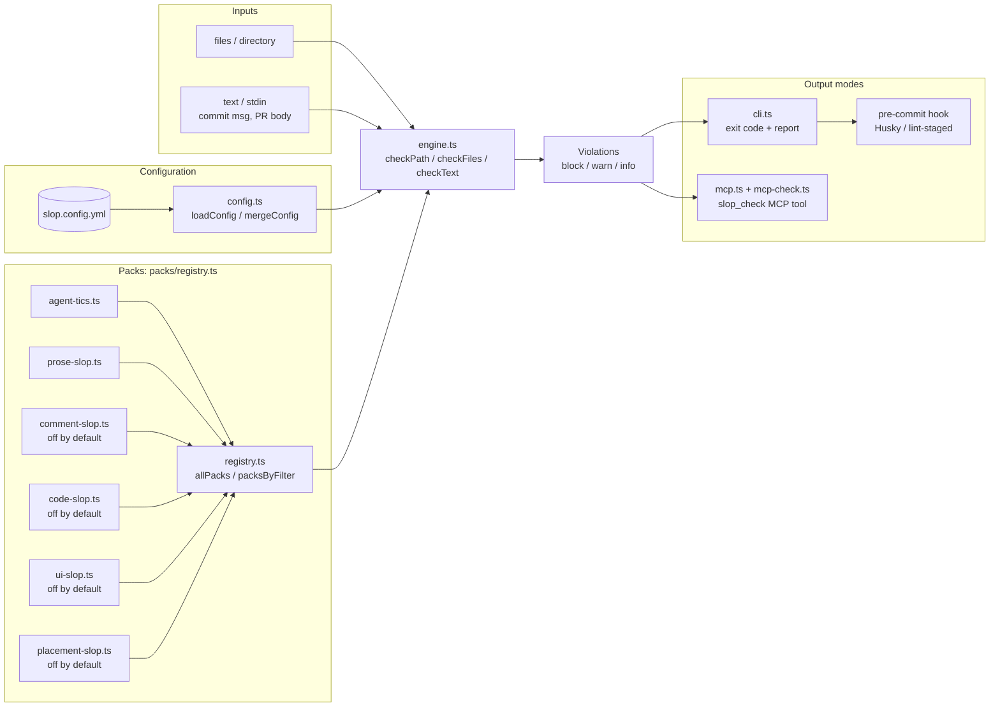

# slop-detector

Configurable AI-slop linter for PRs and committed content. Catches the recognisable tells of agent-generated text: leaked tool-call XML wrappers, em-dashes in user-facing prose, hedging openers, marketing adjectives, doubled summary headings.

Part of [agent-dx](https://github.com/LanNguyenSi/agent-dx), playbooks and tooling for teams shipping with AI agents.

## Why

Agents leave fingerprints. Some are objectively wrong, like leaked `</result>` artefacts from MCP serialisation. Others are stylistic tells the team has already decided to avoid: em-dashes in prose, `It is important to note` openers, empty marketing adjectives, doubled `## Summary` blocks. None are caught by tests, typecheck, or human reviewers under load. They accumulate.

Concrete data point: when `slop-detector` ran for the first time against the bodies of the 20 most recent merged PRs across LanNguyenSi/, it found 38 real violations (27 em-dashes, 11 auto-appended Claude Code footers) across 13 of the 20 PRs. Zero false positives. Every one of those PRs had been written by an agent, reviewed, and merged before the linter existed. The tool's first run was a quiet receipt.

This package turns those rules into a deterministic linter you can run in pre-commit, in CI, or against a directory tree: lint at commit time, not at "I noticed three months later."

## Install

slop-detector is not yet published to npm (the bare `slop-detector` name is an unrelated third-party package), so run it from a local build of this monorepo:

```bash
git clone https://github.com/LanNguyenSi/agent-dx
cd agent-dx
cd packages/slop-detector && npm install && npm run build && cd ../..

# alias the local CLI for this shell; the examples below use the bare `slop-detector` command
alias slop-detector="node $PWD/packages/slop-detector/dist/cli.js"
```

Without the alias, invoke the built CLI directly: `node packages/slop-detector/dist/cli.js check README.md`.

## Quick start

```bash
# scan a path (file or directory)
slop-detector check packages/

# scan stdin (use in pre-commit pipes)
git diff --cached --name-only | xargs cat | slop-detector check --stdin-path PR_BODY.md

# only run a specific pack
slop-detector check . --pack agent-tics

# see why a rule fires
slop-detector check . --explain

# JSON output for tooling
slop-detector check . --format json
```

## Rule packs

Each pack groups related rules. Enable or disable per repo via `slop.config.yml`.

| Pack                       | Default                                 | Catches                                                                                                                                                                                                                                                                    |
| -------------------------- | --------------------------------------- | -------------------------------------------------------------------------------------------------------------------------------------------------------------------------------------------------------------------------------------------------------------------------- |
| `agent-tics` (7 rules)     | on                                      | Stray `</result>` / `</invoke>` tags, auto-appended Claude Code footers, doubled Summary headings, template TODO placeholders                                                                                                                                              |
| `prose-slop` (7 rules)     | on                                      | Em-dashes in prose, hedging openers, empty marketing adjectives, signature LLM idioms like `delve into`, `tapestry of`, `leverage the power of`                                                                                                                            |
| `comment-slop` (5 rules)   | off, opt in via `--pack`                | JSDoc on trivial getters, comments that restate the next line, orphan markers (`// removed`, `// kept for backcompat`), comment-heavier-than-body helpers, ASCII banner dividers                                                                                           |
| `code-slop` (9 rules)      | off, opt in via `--pack`                | try/catch around code that cannot throw, defaults on required-typed params, empty / rethrow catches, `async` without `await`, backcompat shims for unreleased APIs, phantom imports of undeclared packages, stub function bodies, unused exports, single-callsite helpers  |
| `ui-slop` (6 rules)        | off, opt in via `--pack ui-slop`        | Gradient text, purple+cyan AI palettes, animated layout properties, skipped heading levels, plus opt-in monospace-everywhere and flat type hierarchy (info-level). Scans CSS / SCSS / LESS / HTML / JSX.                                                                   |
| `placement-slop` (5 rules) | off, opt in via `--pack placement-slop` | Org-, machine-, and point-in-time-bound evidence leaking into reusable instruction files (`SKILL.md`, `AGENTS.md`, `CLAUDE.md`, agent/skill prompt files): home paths, dated evidence, tally phrases (`n=8`, `p=0.016`, `so far`), opaque ids, and configured org markers. |

The four opt-in packs (`comment-slop`, `code-slop`, `ui-slop`, `placement-slop`) are off by default because their false-positive surface in mixed codebases is wider; opt in with `--pack <id>` or set `packs.<id>: true` in `slop.config.yml`.

Run `slop-detector list-rules` for the full rule catalogue with severities and rationales.

### `ui-slop` (M3 v1) by example

Opt in with `--pack ui-slop`. Examples that trip the four default-on rules:

```css
/* ui-slop/gradient-text */
.headline {
  background: linear-gradient(90deg, #7c3aed, #06b6d4);
  -webkit-background-clip: text;
  color: transparent;
}

/* ui-slop/ai-color-palette */
.hero {
  background: radial-gradient(circle, hsl(270, 70%, 50%), hsl(185, 80%, 50%));
}

/* ui-slop/animate-layout-properties */
@keyframes grow {
  from {
    width: 100px;
  }
  to {
    width: 200px;
  }
}
.panel {
  transition: height 0.3s ease;
}
```

```html
<!-- ui-slop/skipped-heading-levels -->
<section>
  <h1>Title</h1>
  <h3>Subtitle</h3>
  <!-- skipped h2 -->
</section>
```

The two off-by-default info rules (`ui-slop/monospace-everywhere`, `ui-slop/flat-type-hierarchy`) need an explicit `rules.<id>.enabled: true` in `slop.config.yml` or a CLI override; they remain off because both have legitimate counter-uses (technical-product landing pages, mature design systems with subtle steps).

Known v1 limitations (tracked as M3 follow-ups):

- Tailwind class strings like `bg-gradient-to-r from-purple-500 to-cyan-500` are not detected; only literal CSS / hex / hsl in style declarations.
- JSX inline `style={{ background: 'linear-gradient(...)' }}` literals are not scanned for rules 1-3 (only `ui-slop/skipped-heading-levels` walks JSX).
- Vue / Svelte single-file-component `<style>` blocks are detected as `markup`, so CSS-shape rules don't fire on them; extract the styles or scope a separate `.css` file.
- `@media`-wrapped top-level selectors are not walked recursively by `ui-slop/monospace-everywhere`.
- `transition: all` is flagged, but `animation: <name>` referencing a `@keyframes` outside the same file is not cross-resolved.

### `placement-slop` by example

Opt in with `--pack placement-slop`. Every rule below only looks at instruction files: `SKILL.md`, `AGENTS.md`, `CLAUDE.md`, and Markdown under `.claude/agents/`, `.opencode/agents/`, `.claude/skills/` (plus anything matched by `placement.instructionGlobs`). The same content in, say, `README.md` never fires.

```markdown
<!-- placement-slop/home-path (block) -->

Set `API_TOKEN` from `~/work/project/.env` before running the sweep.

<!-- placement-slop/dated-evidence + placement-slop/tally-phrase (warn) -->

As of 2026-08-24 (n=8), the low tier reached accept a median 320 seconds
slower, p=0.016, so prefer the default tier.

<!-- placement-slop/opaque-id (warn) -->

See agent-tasks task 7f38899d for the write-up.

<!-- placement-slop/org-marker (block), with placement.markers: ["example-org"] -->

Run the example-org rescan before merging.
```

Every rule reports the durable instruction it thinks should replace the evidence-bound line, not just what tripped: a home path should become repo-relative, a dated measurement should become the standing rule it justified, an opaque id should become a link or be dropped, and an org marker should either be genericized or explicitly allow-listed.

`home-path`, `dated-evidence`, `opaque-id`, and `tally-phrase` skip matches inside an `http(s)://`/`www.` URL or a markdown link target (`](...)`) — a path segment, a date, a hex id, or a `?n=8`/`?p=0.016`-shaped query parameter that's part of a real link isn't leaked evidence. `home-path` also treats an angle-bracket placeholder (`/Users/<name>/`, `/home/<user>/`) as already-generic and doesn't flag it. A real account name in a path (`/home/node/app`, a container convention) still fires: telling a genuine machine-bound path apart from a container-convention one isn't a clean heuristic, so it's still flagged — add a disable comment for that line if it's a false positive in your repo, or a `placement.allow` entry to excuse the marker span itself.

`placement.allow` is the escape hatch for a span that legitimately carries a marker, e.g. an install URL:

```yaml
# slop.config.yml
packs:
  placement-slop: true

placement:
  markers:
    - "example-org"
  allow:
    - "github\\.com/example-org/"
```

With that config, `install from https://github.com/example-org/kit` does not fire `org-marker` (the `allow` pattern matches the URL span), while a bare `example-org` mention elsewhere in the file still does.

An `allow` match only excuses the span it actually matched, across every rule in the pack, including `block`-severity ones like `home-path` and `org-marker`: it is not a whole-line escape hatch. A home path, a date, or a tally phrase elsewhere on the same line as an allowed URL still fires, since it falls outside the span the `allow` pattern matched. An `allow` span also never crosses a line break, so a phrase wrapped across one (e.g. a tally phrase split by a line wrap) cannot be excused by `allow`; use a per-line disable comment for that case instead. To silence a single rule (or a single occurrence) instead, use a per-line disable comment: `<!-- slop-detector:disable-line=placement-slop/home-path -->` or `<!-- slop-detector:disable-next-line=placement-slop -->` (see [Per-line opt-out](#per-line-opt-out)).

## What a run looks like

```
examples/slop-sample.md
  WARN  3:1    prose-slop/hedging-opener     Hedging opener `It is important to note that`
  WARN  3:40   prose-slop/marketing-adjectives  Empty marketing adjective `cutting-edge`
  WARN  3:121  prose-slop/delve-tapestry     LLM idiom `leverage the power of`
  WARN  7:42   prose-slop/delve-tapestry     LLM idiom `delve into`
  WARN  12:42  prose-slop/em-dash            Em-dash in prose
  WARN  15:1   agent-tics/doubled-summary-heading  Second `Summary` heading
  WARN  19:1   agent-tics/placeholder-todo   Unresolved template placeholder
  WARN  21:1   agent-tics/claude-code-footer Auto-appended Claude Code attribution footer
  ... 12 more

1 files scanned, 20 violations (block 0, warn 20, info 0)
```

`--explain` adds a one-line rationale per violation. Promote any rule to `block` per repo via `slop.config.yml`; the two `agent-tics` rules that catch leaked tool-call XML wrappers (`</result>`, `</invoke>`) ship as `block` by default since those are objectively wrong.

## Scan pipeline

The scan pipeline shows how slop-detector routes input through config and pack selection into the rule engine, then fans out to the three output surfaces.


```mermaid
flowchart LR
    subgraph In["Inputs"]
        A["files / directory"]
        B["text / stdin<br/>commit msg, PR body"]
    end

    subgraph Cfg["Configuration"]
        C[("slop.config.yml")]
        D["config.ts<br/>loadConfig / mergeConfig"]
    end

    subgraph Packs["Packs: packs/registry.ts"]
        E["registry.ts<br/>allPacks / packsByFilter"]
        F["agent-tics.ts"]
        G["prose-slop.ts"]
        H["comment-slop.ts<br/>off by default"]
        I["code-slop.ts<br/>off by default"]
        J["ui-slop.ts<br/>off by default"]
        P["placement-slop.ts<br/>off by default"]
    end

    K["engine.ts<br/>checkPath / checkFiles / checkText"]
    L["Violations<br/>block / warn / info"]

    subgraph Out["Output modes"]
        M["cli.ts<br/>exit code + report"]
        N["mcp.ts + mcp-check.ts<br/>slop_check MCP tool"]
        O["pre-commit hook<br/>Husky / lint-staged"]
    end

    A --> K
    B --> K
    C --> D
    D --> K
    F --> E
    G --> E
    H --> E
    I --> E
    J --> E
    P --> E
    E --> K
    K --> L
    L --> M
    L --> N
    M --> O
```

## Severity model

Each rule has a default severity:

- `block`: exits non-zero in CLI, fails pre-commit / CI checks. Reserved for objectively-wrong patterns (stray XML tags).
- `warn`: surfaced but does not fail. Default for stylistic rules.
- `info`: listed but treated as advisory. Used for rules that have legitimate counter-examples.

Promote any rule to `block` (or downgrade to `info`) per repo:

```yaml
# slop.config.yml
rules:
  prose-slop/em-dash:
    severity: block
  agent-tics/claude-code-footer:
    enabled: false
```

## Configuration

```yaml
# slop.config.yml
packs:
  agent-tics: true
  prose-slop: true
  comment-slop: false

rules:
  prose-slop/em-dash:
    severity: block
  prose-slop/redundant-note:
    enabled: true

ignorePaths:
  - "**/vendor/**"
  - "docs/legal/**"

treatAsProse:
  - "**/CHANGELOG.md"
  - "**/templates/*.txt"

treatAsCode:
  - "**/Dockerfile.*"

placement:
  markers:
    - "example-org"
  instructionGlobs:
    - "**/PLAYBOOK.md"
  allow:
    - "github\\.com/example-org/"
```

Defaults applied even without a config: `agent-tics` and `prose-slop` packs on; `comment-slop`, `code-slop`, `ui-slop`, `placement-slop` off; ignores cover `node_modules`, `dist`, `build`, `coverage`, `.git`, lockfiles; `placement.markers`, `placement.instructionGlobs`, and `placement.allow` default to `[]`.

The `placement` block only matters once `placement-slop` is enabled (see [`placement-slop` by example](#placement-slop-by-example)):

- `markers`: regex patterns (compiled as given, no implicit `i` flag) naming this org's own handles, products, or paths: each match is a `placement-slop/org-marker` violation. Empty by default, so the rule never fires until you configure it. A pattern that would match the empty string (e.g. `"a*"`) is rejected at config-load time, and matching runs per line with a 50-violations-per-file cap, so a runaway or pathological pattern can't blow up the output. These are repo-authored regexes, evaluated by the linter itself, not by an external process.
- `instructionGlobs`: additive glob patterns, on top of the pack's built-in instruction-file globs (`SKILL.md`, `AGENTS.md`, `CLAUDE.md`, `.claude/agents/**`, `.opencode/agents/**`, `.claude/skills/**`); this only ever widens the built-in set, it can't narrow it. Matched against each scanned file's path relative to the scan root (the same root `entrypointGlobs` uses — see [Marking a src barrel as an entrypoint](#marking-a-src-barrel-as-an-entrypoint)). `check packages/foo`, `check ./packages/foo`, and `check /abs/path/packages/foo` are three spellings of the _same_ directory and resolve a given pattern identically; a single-file target (`check packages/foo/SKILL.md`) resolves the scan root to that file's own parent directory, so it also shares patterns with `check packages/foo`: a pattern is tied to _what directory you're scanning_, not to whether the target was a file or a directory. The consequence: changing the scan target to a genuinely different root (e.g. `check .` from the repo root instead of `check packages/foo`) means every pattern has to be rewritten relative to the new root too. A pattern must not start with `/`, same restriction as `entrypointGlobs`, and a leading `./` is normalized away. A pattern that matches zero scanned files is surfaced in `CheckSummary.warnings`, same mechanism as an unmatched `entrypointGlobs` pattern. For CI, the simplest invariant is `check .` from the repo root paired with a config file: one fixed scan root, so the patterns never need to change with the invocation.
- `allow`: regex patterns (also rejected at config-load time if they'd match the empty string), matched per line, and only the matched span is excused across every rule in the pack, including `block`-severity ones (the escape hatch for something like a legitimate install URL that carries an org handle). The exclusion is scoped to the matched span, not the whole line: a home path, a date, or a tally phrase elsewhere on the same line as an allowed match still fires. For narrower, single-rule suppression use a per-line disable comment instead (see [Per-line opt-out](#per-line-opt-out)).

## Cross-file rules (experimental)

Two `code-slop` rules analyse symbols across all files in the scan root rather than per file. They are **off by default** and require a corpus pre-pass that parses every TypeScript/JavaScript file once before the rule loop runs. The pre-pass also builds an inverted name → referencing-files index, so `unused-export`'s "does any other file use this?" check is an O(1) map lookup per export rather than an O(files) scan repeated for every export in the scan root.

| Rule                               | Default severity | What it finds                                                                                                                                                                                                                                                                                                                                                                                                                                                                                                                                                                                                                                                                                                                                                 |
| ---------------------------------- | ---------------- | ------------------------------------------------------------------------------------------------------------------------------------------------------------------------------------------------------------------------------------------------------------------------------------------------------------------------------------------------------------------------------------------------------------------------------------------------------------------------------------------------------------------------------------------------------------------------------------------------------------------------------------------------------------------------------------------------------------------------------------------------------------- |
| `code-slop/unused-export`          | warn             | Exported symbols not imported by any other file and not reachable via `package.json` entrypoints (`main`, `bin`, `exports`, or `entrypointGlobs`).                                                                                                                                                                                                                                                                                                                                                                                                                                                                                                                                                                                                            |
| `code-slop/single-callsite-helper` | warn             | Named functions/`const`s with a body of at most 3 statements that are called from at most one place in the package (candidates for inlining). Exempts files reachable via an entrypoint, same as `unused-export` — a helper whose only real callers are external to the scan is expected to show a low in-package call count. Precision cost of that exemption: it's file-wide, so a genuinely inlinable one-callsite helper that happens to live in the entrypoint/barrel file is now permanently invisible to this rule, not just the helpers that are actually part of the public API. This also applies to a bare `export *` barrel target, not just `package.json`/`entrypointGlobs` entrypoints — see the blast-radius note in Known limitations below. |

### Enabling the corpus pre-pass

Three equivalent switches, use whichever fits your workflow:

**Environment variable** (one-off or CI step):

```sh
SLOP_CORPUS=1 slop-detector check src/
```

**Config file** (`slop.config.yml`):

```yaml
corpus: true
```

**Programmatic API** (`CheckOptions`):

```ts
import { checkFiles } from "slop-detector";
checkFiles(files, { packs, config, corpusEnabled: true });
```

### Opting individual rules in

Because both rules are `enabledByDefault: false` you must also enable them via `ruleOverrides`:

```yaml
# slop.config.yml
corpus: true # enable the pre-pass

rules:
  code-slop/unused-export:
    enabled: true
  code-slop/single-callsite-helper:
    enabled: true
```

### Marking a src barrel as an entrypoint

`package.json` `main`/`bin`/`exports` fields typically point at compiled output (`dist/index.js`). When the scan targets `src/`, those paths don't resolve to any file in the scan root, so the real `src/` public-API barrel is never recognised as an entrypoint and its re-exports get flagged as unused. Use `entrypointGlobs` to mark it explicitly:

```yaml
# slop.config.yml
corpus: true
entrypointGlobs:
  - "src/index.ts"
```

Patterns are matched against each scanned file's path relative to `scanRoot` (the CLI passes the path/directory you told it to `check`); when no `scanRoot` is available (e.g. a bare `checkFiles([...])` call with no option), the nearest directory containing a `package.json` is used, and failing that, `process.cwd()`. A pattern must not start with `/` — that can never match a relative path and is rejected at config-load time. A pattern that matches zero scanned files (a typo, or the wrong root assumption) doesn't fail silently: `checkFiles`'s returned `CheckSummary.warnings` names it. There's no equivalent guard against an _overly broad_ pattern, though — `entrypointGlobs: ["**"]` is valid config that silently exempts every file and reduces both rules to zero output; treat a broad barrel pattern as suspicious paired with the two rules producing nothing.

### Known limitations (v1)

- **Name-only, scope-blind symbol matching.** The corpus matches symbols by identifier name across files, not by import binding or lexical scope. Two unrelated exports with the same name in different files are counted as references to each other (false negative on `unused-export`). A local variable or parameter that shadows an imported/exported name may likewise suppress a violation (false positive suppression). Both re-export forms are handled: a named re-export (`export { x } from "./mod.js"`) counts as a reference to `x`, so the original declaration is no longer flagged — but the re-export statement itself is also tracked as an export _of the barrel file_, so if nothing consumes `x` from the barrel either (and the barrel isn't an entrypoint), the "unused" violation simply moves from the declaration to the barrel rather than disappearing; that's a defensible outcome (the barrel re-export genuinely is the dead surface in that case) but worth knowing when triaging a violation's location. `export * as ns from "./mod.js"` declares a real name (`ns`) on the barrel file and is tracked exactly like a named re-export — same "moves to the barrel" behavior applies to it. A _bare_ `export * from "./mod.js"` (no `as ns`) is different: it declares no trackable name of its own, so instead the whole resolved target file is treated as reachable public API (like a `main`/`entrypointGlobs` entrypoint) rather than tracking which individual symbols the barrel actually forwards — resolving that precisely would mean walking the full re-export graph. **Blast radius of that exemption: it applies to both corpus rules, not just `unused-export`.** A file that's the target of a bare `export *` is fully invisible to `single-callsite-helper` too — a genuinely dead or genuinely inlinable symbol inside it won't be flagged by either rule, not only the ones actually re-exported through the barrel. TypeScript's `export = foo` (CommonJS-style export assignment) is recognised as neither an export nor a reference at all; a file using it will misbehave under both corpus rules. A **non-call** use of an identifier (passing a function by reference, e.g. `arr.map(helperA)`, `setTimeout(helperA)`, `export const onClick = helperA`) is also still not tracked, so a helper consumed only that way can be misflagged as unused or single-callsite. Treat both rules as directional signals to double-check, not ground truth, until these are closed.
- **`buildCorpus` still makes a separate initial pass** over every file before the per-file rule loop runs. Measured on a synthetic 500-file project (median of 7 warmed runs, `code-slop` pack with both corpus rules enabled): `checkFiles` took ~172ms with the corpus pre-pass off and ~343ms with it on — the extra pass costs roughly as much as the rest of the scan combined (about half of corpus-on runtime), several times more than the O(files²)→O(1) lookup this change removed. It exists because `buildCorpus` and the per-file rule loop each construct their own `FileTarget` for the same file, and `parseTsFile`'s cache is a `WeakMap` keyed by that object — so the second pass's parse is always a cache miss, never reused. Unlike the double-parse `code-slop/unused-export` used to do (fixed in this change: it now reads `corpus.exportsByFile` directly instead of re-parsing), this one is structural: threading the corpus's own `FileTarget`s through into the main loop, or keying the parse cache by path+text instead of by object identity, would close it, but that's a `checkFiles`-level change and is an open follow-up, not something fixed here.

## Per-line opt-out

Disable on a single line:

```md
This sentence has a deliberate em-dash — and it stays. <!-- slop-detector:disable-line=prose-slop/em-dash -->
```

Or scope by pack:

```md
<!-- slop-detector:disable-next-line=agent-tics -->

</result> a real example for the docs
```

`slop-detector:disable-line` and `slop-detector:disable-next-line` accept either a rule id, a pack id, or no argument (disables every rule on that line).

## Pre-commit recipe (Husky)

```jsonc
// package.json
{
  "scripts": {
    "slop": "slop-detector check .",
  },
  "husky": {
    "hooks": {
      "pre-commit": "npm run slop",
    },
  },
}
```

For a faster, staged-files-only variant pair with [lint-staged](https://github.com/okonet/lint-staged):

```jsonc
{
  "lint-staged": {
    "*.md": "slop-detector check",
  },
}
```

## CI usage

```yaml
- name: Slop check
  run: |
    (cd packages/slop-detector && npm install && npm run build)
    node packages/slop-detector/dist/cli.js check . --format json > slop-report.json
```

A dedicated GitHub Action with PR annotations is planned for M3.

## MCP server

slop-detector also ships a stdio [MCP](https://modelcontextprotocol.io) server (`bin`: `slop-detector-mcp`, entry point `dist/mcp.js`), so an agent can scan commit messages, PR bodies, and files as a native tool call instead of shelling out to the CLI.

It exposes one tool, `slop_check`:

| Param        | Type     | Notes                                                              |
| ------------ | -------- | ------------------------------------------------------------------ |
| `text`       | string   | In-memory string to scan. Mutually exclusive with `path`.          |
| `path`       | string   | File or directory to scan. Mutually exclusive with `text`.         |
| `filename`   | string   | Filename assumed for `text` input (prose-vs-code detection).       |
| `packs`      | string[] | Restrict to these packs; off-by-default packs only run when named. |
| `configPath` | string   | Path to a `slop.config.yml` / `.json`.                             |

It returns each violation as `SEVERITY line:col rule message`, grouped by file, plus a one-line tally.

Register it with your runtime by pointing at the built entry point:

```json
{
  "mcpServers": {
    "slop-detector": {
      "command": "node",
      "args": ["/absolute/path/to/slop-detector/dist/mcp.js"]
    }
  }
}
```

Run `npm run build` first so `dist/mcp.js` exists.

## Exit codes

| Code | Meaning                                                                                 |
| ---- | --------------------------------------------------------------------------------------- |
| 0    | No `block`-severity violations. `warn` and `info` are reported but do not fail the run. |
| 1    | At least one `block`-severity violation.                                                |
| 2    | CLI invocation error (missing config, unreadable path).                                 |

## Roadmap

- M1: `agent-tics` + `prose-slop` packs, CLI, config loader, per-line disables.
- M2: `comment-slop` + `code-slop` packs (TypeScript AST via `@typescript-eslint/parser`). Both off by default; opt in via config or `--pack`. Within-file analysis only for all rules except the two experimental cross-file rules (`code-slop/unused-export`, `code-slop/single-callsite-helper`), which require the corpus pre-pass (see [Cross-file rules](#cross-file-rules-experimental)).
- M3 (this release): `ui-slop` v1 pack with 4 default-on warn rules (gradient text, purple+cyan palette, animated layout properties, skipped heading levels) and 2 default-off info rules (monospace-everywhere, flat type hierarchy). Regex-driven over CSS plus tag-shape scan for headings, no new dependencies. Tailwind class strings, JSX inline `style={{...}}` literals, headless-browser contrast/WCAG rules, GitHub Action wrapper, and LLM-judged rules remain on the M3 backlog.

Track progress at [agent-dx](https://github.com/LanNguyenSi/agent-dx) issues and tasks.

## License

MIT, see [LICENSE](../../LICENSE) at repo root.
