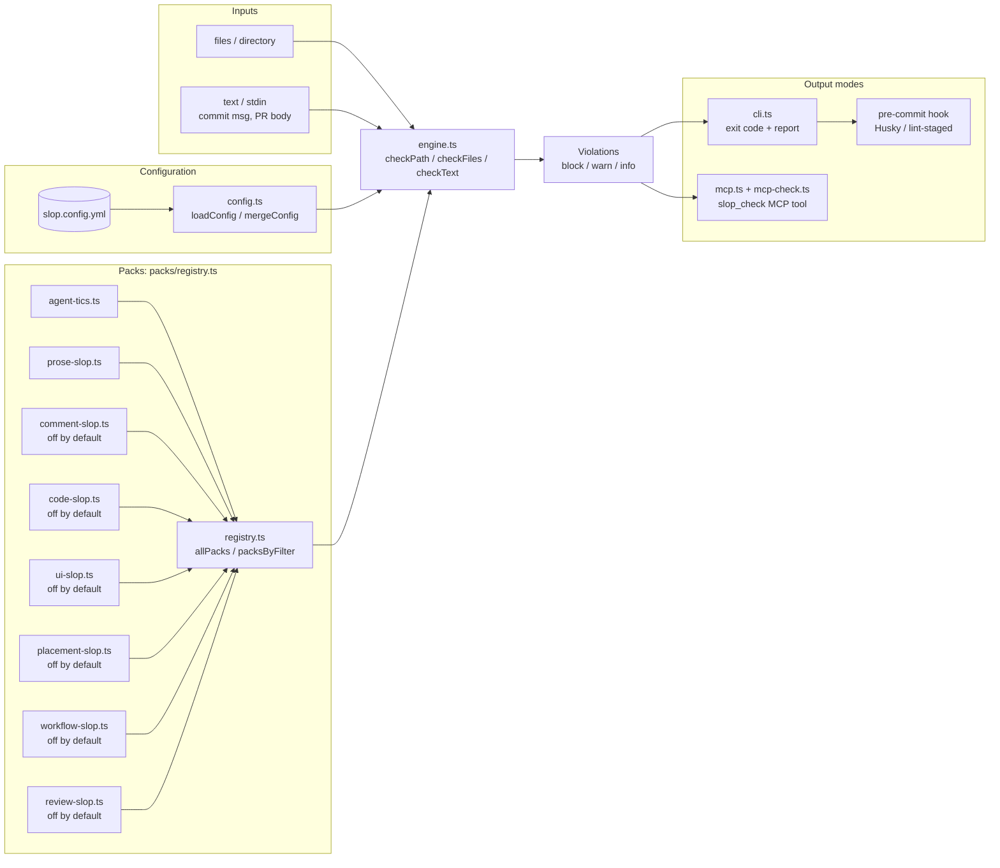

# slop-detector

Configurable AI-slop linter for PRs and committed content. Catches the recognisable tells of agent-generated text: leaked tool-call XML wrappers, em-dashes in user-facing prose, hedging openers, marketing adjectives, doubled summary headings.

Part of [agent-dx](https://github.com/LanNguyenSi/agent-dx), playbooks and tooling for teams shipping with AI agents.

## Why

Agents leave fingerprints. Some are objectively wrong, like leaked `</result>` artefacts from MCP serialisation. Others are stylistic tells the team has already decided to avoid: em-dashes in prose, `It is important to note` openers, empty marketing adjectives, doubled `## Summary` blocks. None are caught by tests, typecheck, or human reviewers under load. They accumulate.

Concrete data point: the first time `slop-detector` ran against a real org's recently merged PR bodies, it found real violations (mostly em-dashes and auto-appended agent-harness footers) across a majority of the sampled PRs, with zero false positives. Every one of those PRs had been written by an agent, reviewed, and merged before the linter existed. The tool's first run was a quiet receipt.

This package turns those rules into a deterministic linter you can run in pre-commit, in CI, or against a directory tree: lint at commit time, not at "I noticed three months later."

## Install

slop-detector is not yet published to npm (the bare `slop-detector` name is an unrelated third-party package), so run it from a local build of this monorepo:

```bash
git clone https://github.com/LanNguyenSi/agent-dx
cd agent-dx
cd packages/slop-detector && npm install && npm run build && cd ../..

# alias the local CLI for this shell; the examples below use the bare `slop-detector` command
alias slop-detector="node $PWD/packages/slop-detector/dist/cli.js"
```

Without the alias, invoke the built CLI directly: `node packages/slop-detector/dist/cli.js check README.md`.

## Quick start

```bash
# scan a path (file or directory)
slop-detector check packages/

# scan stdin (use in pre-commit pipes)
git diff --cached --name-only | xargs cat | slop-detector check --stdin-path PR_BODY.md

# only run a specific pack
slop-detector check . --pack agent-tics

# see why a rule fires
slop-detector check . --explain

# JSON output for tooling
slop-detector check . --format json
```

## Rule packs

Each pack groups related rules. Enable or disable per repo via `slop.config.yml`.

| Pack                       | Default                                 | Catches                                                                                                                                                                                                                                                                    |
| -------------------------- | --------------------------------------- | -------------------------------------------------------------------------------------------------------------------------------------------------------------------------------------------------------------------------------------------------------------------------- |
| `agent-tics` (7 rules)     | on                                      | Stray `</result>` / `</invoke>` tags, auto-appended Claude Code footers, doubled Summary headings, template TODO placeholders                                                                                                                                              |
| `prose-slop` (7 rules)     | on                                      | Em-dashes in prose, hedging openers, empty marketing adjectives, signature LLM idioms like `delve into`, `tapestry of`, `leverage the power of`                                                                                                                            |
| `comment-slop` (5 rules)   | off, opt in via `--pack`                | JSDoc on trivial getters, comments that restate the next line, orphan markers (`// removed`, `// kept for backcompat`), comment-heavier-than-body helpers, ASCII banner dividers                                                                                           |
| `code-slop` (9 rules)      | off, opt in via `--pack`                | try/catch around code that cannot throw, defaults on required-typed params, empty / rethrow catches, `async` without `await`, backcompat shims for unreleased APIs, phantom imports of undeclared packages, stub function bodies, unused exports, single-callsite helpers  |
| `ui-slop` (6 rules)        | off, opt in via `--pack ui-slop`        | Gradient text, purple+cyan AI palettes, animated layout properties, skipped heading levels, plus opt-in monospace-everywhere and flat type hierarchy (info-level). Scans CSS / SCSS / LESS / HTML / JSX.                                                                   |
| `placement-slop` (5 rules) | off, opt in via `--pack placement-slop` | Org-, machine-, and point-in-time-bound evidence leaking into reusable instruction files (`SKILL.md`, `AGENTS.md`, `CLAUDE.md`, agent/skill prompt files): home paths, dated evidence, tally phrases (`n=8`, `p=0.016`, `so far`), opaque ids, and configured org markers. <!-- slop-detector:disable-line=placement-slop --> |
| `workflow-slop` (5 rules)  | off, opt in via `--pack workflow-slop`  | GitHub Actions workflow injection and CI-guard regressions: a `${{ ... }}` expression interpolated directly into a `run:` shell script (unless it is one of the documented non-attacker-controllable contexts); a fail-closed check that a scanned workflow file actually parsed as YAML; a reintroduced Node-20 GitHub Actions major; an `audit.yml` with no certifiable `npm audit --audit-level=...` gate; and an npm-audit gate step whose shape is not one the pack recognises. Scans `.github/workflows/*.yml`/`*.yaml`. |
| `review-slop` (3 rules)    | off, opt in via `--pack review-slop`    | Run-local review tokens leaking into reusable content: finding ids (`F1`, `F2a`), round references (`round 2`, `R3`, `review round 1 fixes`), and workspace-handoff phrases (`per the <workspace> handoffs`). Scans Markdown, TypeScript/JavaScript source comments, test titles, and a commit-message file. |

The six opt-in packs (`comment-slop`, `code-slop`, `ui-slop`, `placement-slop`, `workflow-slop`, `review-slop`) are off by default because their false-positive surface in mixed codebases is wider; opt in with `--pack <id>` or set `packs.<id>: true` in `slop.config.yml`.

Run `slop-detector list-rules` for the full rule catalogue with severities and rationales.

### `ui-slop` (M3 v1) by example

Opt in with `--pack ui-slop`. Examples that trip the four default-on rules:

```css
/* ui-slop/gradient-text */
.headline {
  background: linear-gradient(90deg, #7c3aed, #06b6d4);
  -webkit-background-clip: text;
  color: transparent;
}

/* ui-slop/ai-color-palette */
.hero {
  background: radial-gradient(circle, hsl(270, 70%, 50%), hsl(185, 80%, 50%));
}

/* ui-slop/animate-layout-properties */
@keyframes grow {
  from {
    width: 100px;
  }
  to {
    width: 200px;
  }
}
.panel {
  transition: height 0.3s ease;
}
```

```html
<!-- ui-slop/skipped-heading-levels -->
<section>
  <h1>Title</h1>
  <h3>Subtitle</h3>
  <!-- skipped h2 -->
</section>
```

The two off-by-default info rules (`ui-slop/monospace-everywhere`, `ui-slop/flat-type-hierarchy`) need an explicit `rules.<id>.enabled: true` in `slop.config.yml` or a CLI override; they remain off because both have legitimate counter-uses (technical-product landing pages, mature design systems with subtle steps).

Known v1 limitations (tracked as M3 follow-ups):

- Tailwind class strings like `bg-gradient-to-r from-purple-500 to-cyan-500` are not detected; only literal CSS / hex / hsl in style declarations.
- JSX inline `style={{ background: 'linear-gradient(...)' }}` literals are not scanned for rules 1-3 (only `ui-slop/skipped-heading-levels` walks JSX).
- Vue / Svelte single-file-component `<style>` blocks are detected as `markup`, so CSS-shape rules don't fire on them; extract the styles or scope a separate `.css` file.
- `@media`-wrapped top-level selectors are not walked recursively by `ui-slop/monospace-everywhere`.
- `transition: all` is flagged, but `animation: <name>` referencing a `@keyframes` outside the same file is not cross-resolved.

### `placement-slop` by example

Opt in with `--pack placement-slop`. Every rule below only looks at
instruction files: by default that means `SKILL.md`, `AGENTS.md`,
`CLAUDE.md`, and Markdown under `.claude/agents/`, `.opencode/agents/`,
`.claude/skills/`. The same content in, say, `README.md` never fires
under the built-in defaults; a repo can widen the set with
`placement.instructionGlobs` (below).

A monorepo with many package READMEs is a common case worth widening
for: a package README is exactly as reusable and exactly as
leak-prone as a `SKILL.md`, and nothing in the built-in defaults
covers it.

```yaml
placement:
  instructionGlobs:
    - "packages/*/README.md"
```

```markdown
<!-- placement-slop/home-path (block) -->
<!-- slop-detector:disable-next-line=placement-slop -->
Set `API_TOKEN` from `/home/alice/work/project/.env` before running the sweep.

<!-- placement-slop/dated-evidence + placement-slop/tally-phrase (warn) -->
<!-- slop-detector:disable-next-line=placement-slop -->
As of 2026-08-24 (n=8), the low tier reached accept a median 320 seconds slower, p=0.016, so prefer the default tier.

<!-- placement-slop/opaque-id (warn) -->
<!-- slop-detector:disable-next-line=placement-slop -->
See agent-tasks task 7f38899d for the write-up.

<!-- placement-slop/org-marker (block), with placement.markers: ["example-org"] -->

Run the example-org rescan before merging.
```

Every rule reports the durable instruction it thinks should replace the evidence-bound line, not just what tripped: a home path should become repo-relative, a dated measurement should become the standing rule it justified, an opaque id should become a link or be dropped, and an org marker should either be genericized or explicitly allow-listed.

`home-path`, `dated-evidence`, `opaque-id`, and `tally-phrase` skip matches inside an `http(s)://`/`www.` URL or a markdown link target (`](...)`) — a path segment, a date, a hex id, or a `?n=8`/`?p=0.016`-shaped query parameter that's part of a real link isn't leaked evidence. `home-path` also treats an angle-bracket placeholder (`/Users/<name>/`, `/home/<user>/`) as already-generic and doesn't flag it. A real account name in a path (`/home/node/app`, a container convention) still fires: telling a genuine machine-bound path apart from a container-convention one isn't a clean heuristic, so it's still flagged — add a disable comment for that line if it's a false positive in your repo, or a `placement.allow` entry to excuse the marker span itself. <!-- slop-detector:disable-line=placement-slop -->

`placement.allow` is the escape hatch for a span that legitimately carries a marker, e.g. an install URL:

```yaml
# slop.config.yml
packs:
  placement-slop: true

placement:
  markers:
    - "example-org"
  allow:
    - "github\\.com/example-org/"
```

With that config, `install from https://github.com/example-org/kit` does not fire `org-marker` (the `allow` pattern matches the URL span), while a bare `example-org` mention elsewhere in the file still does.

An `allow` match only excuses the span it actually matched, across every rule in the pack, including `block`-severity ones like `home-path` and `org-marker`: it is not a whole-line escape hatch. A home path, a date, or a tally phrase elsewhere on the same line as an allowed URL still fires, since it falls outside the span the `allow` pattern matched. An `allow` span also never crosses a line break, so a phrase wrapped across one (e.g. a tally phrase split by a line wrap) cannot be excused by `allow`; use a per-line disable comment for that case instead. To silence a single rule (or a single occurrence) instead, use a per-line disable comment: `<!-- slop-detector:disable-line=placement-slop/home-path -->` or `<!-- slop-detector:disable-next-line=placement-slop -->` (see [Per-line opt-out](#per-line-opt-out)).

### `workflow-slop` by example

Opt in with `--pack workflow-slop`. The main rule, `run-expression`, only
looks at `run:` scalars inside `.github/workflows/*.yml`/`*.yaml` (a
`${{ ... }}` in `name:`, `if:` or `env:` is never a finding, and neither is
a `run` key inside a `uses:` step's `with:` input block; a `with:` mapping
that is not a `uses:` step's input block is still scanned, fail-closed). GitHub substitutes `${{ ... }}`
expressions into the workflow's YAML text *before* the shell ever sees
`run:`, so an expression whose value an attacker can influence — a step
output computed from a PR title, a branch or tag name, an issue body —
becomes program text in that shell, not a string argument. This pack
exists because of a real incident: an agent-tasks release workflow
interpolated `${{ steps.target.outputs.expected }}` (derived from a
pushed tag) straight into a `run:` body; a tag like
`mcp-server-v0.0.0";id;"` passes `git check-ref-format`, and the job
(holding `id-token: write` and publish rights) executed the injected
command. The fix is always the same shape: assign the value to an
`env:` variable and reference it as `$NAME`, where the shell treats it
as inert data.

```yaml
# BLOCKED by workflow-slop/run-expression
- id: target
  run: echo "expected=$TAG" >> "$GITHUB_OUTPUT"
- run: npm publish --tag ${{ steps.target.outputs.expected }}
```

```yaml
# fixed: routed through env:
- id: target
  run: echo "expected=$TAG" >> "$GITHUB_OUTPUT"
- env:
    EXPECTED: ${{ steps.target.outputs.expected }}
  run: npm publish --tag "$EXPECTED"
```

The rule is YAML-structure-aware (it parses the file and locates the
actual `run:` value node, not a text-shaped guess), so it finds every
`${{ ... }}` inside a `run:` scalar regardless of style: plain,
single- or double-quoted, or a block scalar (`|`/`>`) spanning many
lines.

**Allowlist.** An expression is only excused when the *entire*
`${{ ... }}` body (whitespace-trimmed) is one of the following — this
rule does not parse the GitHub Actions expression grammar, so a
compound expression (a function call, a comparison, a concatenation)
built out of only-safe pieces is still flagged rather than risk
misjudging a mixed expression as safe:

| Allowed | Why |
| --- | --- |
| `github.workspace`, `github.action_path`, `github.run_id`, `github.run_number`, `github.run_attempt`, `github.sha`, `github.job`, `github.repository`, `github.repository_owner`, `github.actor`, `github.event_name`, `github.workflow`, `github.server_url`, `github.api_url`, `github.token`, `runner.temp`, `runner.os`, `runner.arch`, `runner.tool_cache` | Runtime-assigned metadata, not free text an external contributor supplies. Verified against GitHub's [contexts reference](https://docs.github.com/en/actions/reference/workflows-and-actions/contexts): each is documented as an identifier, a URL, a path, a count, or a fixed enum — for example `github.actor` is "the username of the user that triggered the initial workflow run" (a username, not free text), `github.run_id` is "a unique number for each workflow run." |
| `secrets.<NAME>` (any name) | The *value* of a secret is never attacker-supplied; only the workflow author chooses which secret names exist. |
| `steps.<id>.outcome`, `steps.<id>.conclusion` (any step id) | Not step *outputs*. GitHub's contexts reference documents both as exactly one of `success`, `failure`, `cancelled`, or `skipped`, assigned by the runner itself — never attacker-influenced text, unlike `steps.<id>.outputs.<name>` (a value the step's own script chose to emit), which stays flagged. |

**Not allowed** (verified against GitHub's [security hardening guide](https://docs.github.com/en/actions/security-for-github-actions/security-guides/security-hardening-for-github-actions), which walks through exactly this `run:`-injection shape using `github.event.pull_request.title` as its example of untrusted input, and the contexts reference, which documents `github.head_ref` as "the `head_ref` or source branch of the pull request" — a value a forked contributor names themselves): `github.ref`, `github.ref_name`, `github.head_ref`, `github.base_ref`, `github.event.*`, `steps.*.outputs.*`, `needs.*.outputs.*`, `inputs.*`, `env.*`, `vars.*`. The documented fix for every one of these is the same `env:`-routing pattern shown above.

**`matrix.*` is deliberately not in the default allowlist**, even though a matrix built entirely from literals in the workflow is safe: this rule inspects one `run:` scalar in isolation and has no way to confirm, from that scalar alone, that every value the matrix can take is a literal (as opposed to one sourced from `steps.*.outputs`, `needs.*`, or an untrusted `include`/`exclude`). A repo that has verified its own matrix is literal-only can allowlist it explicitly:

```yaml
# slop.config.yml
packs:
  workflow-slop: true

workflow:
  allowExpressions:
    - "matrix.node"
```

`workflow.allowExpressions` is additive (on top of the built-in allowlist above) and matches by exact, whitespace-trimmed expression text — same shape as `placement.allow`'s per-pack config surface, just without the regex/span matching (each entry is a literal expression body, not a pattern). An entry that matched no `${{ ... }}` expression across the scanned workflow files (a typo, or leftover from a workflow that changed) is surfaced in `CheckSummary.warnings`, the same mechanism an unmatched `placement.instructionGlobs` pattern uses. Write the bare expression body only (`matrix.node`), not the `${{ ... }}` wrapper; a config entry that still carries `${{`/`}}` is rejected at config-load time.

**`unparseable-workflow`: a broken workflow file is never scored clean.** `run-expression` walks the YAML tree `yaml`'s parser produced, but that parser does not throw on most syntax errors, it records them and still returns whatever partial tree it managed to build. A workflow file broken partway through (an unterminated quoted scalar, an unbalanced flow collection) can silently drop everything after the break, including a `${{ ... }}` expression this pack exists to catch. The `unparseable-workflow` rule reports one `block`-severity finding whenever a scanned workflow file has a YAML syntax error, naming the file and the first parse error, so a broken file always produces at least one workflow-slop finding instead of a false-clean result.

**`node20-action-major`: a reintroduced Node-20 GitHub Actions major.** A fleet sweep can move every workflow off the actions/runtimes still pinned to a deprecated Node-20 major, but nothing then stops a later edit (a copy-pasted step, an unreviewed dependency bump) from reintroducing one. This rule flags any `uses:` value (job-level or step-level) whose `owner/repo@major` is on a Node-20 list:

```yaml
# BLOCKED by workflow-slop/node20-action-major
- uses: actions/checkout@v4
```

```yaml
# fixed: bump past the flagged major
- uses: actions/checkout@v5
```

The list is data, not hardcoded logic: `src/data/node20-actions.ts` ships a default list, each entry verified by fetching that action's `action.yml` at the moving major tag and reading `runs.using`. Extend it per repo without waiting on a package release:

```yaml
# slop.config.yml
packs:
  workflow-slop: true

workflow:
  node20Majors:
    - "acme/custom-action@v1"
  node20MajorsIgnore:
    - "actions/checkout@v4"
```

`node20Majors` adds entries on top of the default list; `node20MajorsIgnore` is applied after, so it can drop a default-list entry (an action that has since moved off Node 20) or one added via `node20Majors`. Both take the same `owner/repo@vN` shape, matched case-insensitively (`Actions/Checkout@V4` resolves to the same entry as `actions/checkout@v4`; the config file's own `owner/repo@vN` shape check still requires a lowercase `v`, e.g. `actions/checkout@v4`, not `@V4`, ahead of the digits). A trailing prerelease-ish suffix on the ref is tolerated and ignored for major resolution (`actions/checkout@v4-beta` still resolves to major `v4`); this is a deliberate simplification, not full semver-prerelease parsing.

A local `./path` action and a `docker://image` reference are never flagged (neither names a published `owner/repo@vN` action). A reusable-workflow call (`uses:` naming a `.yml`/`.yaml` file rather than an action) is excluded the same way, even when its ref happens to look like a listed major (including when the reusable workflow's own owner/repo, e.g. `actions/checkout/.github/workflows/build.yml@v4`, is itself on the default list). A `uses:` value written inside a step's own `with:` input block (a custom action can name an input literally `uses`) is not collected as a step, the same schema-position gating `run-expression` already applies to `run:`. A `uses:` pinned to a full commit sha is only checked when the same line also carries a trailing `# vN` comment (`uses: actions/checkout@8f4b7f8 # v4`, case-insensitive); a bare sha pin with no version annotation cannot be resolved to a major from the text alone and is not flagged (a deliberate limitation, not a rule the pack tries to work around). A docker-container action (`runs.using: docker`) or a composite action is never Node-20 by itself and is intentionally left off the default list, even when it commonly sits next to Node-20 actions in the same job.

**`audit-gate-missing` and `audit-gate-shape`: the npm-audit gate in `audit.yml`.** A repo's `audit.yml` can carry a dedicated gate step, `npm audit --audit-level=high` (or `critical`, or the stronger `moderate`/`low`), that fails the job on a matching advisory. Two rules guard it, both `block`, both scoped to files literally named `audit.yml`/`audit.yaml` under `.github/workflows/` and to `npm audit` specifically (see "Scope" below):

- **`audit-gate-missing`** reports an `audit.yml` in which no step's normalised shell statements invoke the gate command at all.
- **`audit-gate-shape`** reports a gate step whose normalised run block matches none of the recognised shapes and no registered template, or whose step or job carries a `continue-on-error` that cannot be proven `false`.

```yaml
# BLOCKED by workflow-slop/audit-gate-shape: unrecognised gate shape
- run: npm audit --audit-level=high || true
```

```yaml
# fixed: let a non-zero exit fail the step (the R-bare shape)
- run: npm audit --audit-level=high
```

**This is a shape allowlist, not a neutralisation blocklist.** An earlier revision of `audit-gate-shape` enumerated the ways a gate can be defused (`|| true`, `; true`, a bare `set +e`, a missing verdict) and reported a block that matched one of them. Every such enumeration leaks in the false-**clean** direction: the next bash construct nobody listed scans green, and bash offers a long tail of them (a shell comment, a here-doc body, a combined `set` flag spelling, a pipeline without `pipefail`, a folded scalar are each a different way to write the same defused gate). The rule asks the opposite question instead, and a gate step is reported **unless** it is recognised. That inverts the leak into false **positives**, which are visible, readable and fixable: register the block as a template, disable the rule for the repo, or use a per-line opt-out. For a `block`-severity security gate that is the only acceptable leak direction. The old enumeration survives only as one extra sentence on a finding that was already reported ("Detected neutralisation signal: ..."); it can never make a block clean.

**Every check reads one normalised view of the run block, never its raw text.** A step's `run:` body goes through a single normalisation step before any check looks at it, and there is no second path:

1. **Here-doc bodies dropped.** On an unquoted `<<`/`<<-` followed by a (possibly quoted) delimiter, the physical lines up to the terminator line are dropped; the redirection statement itself is kept, because it is real program text. A gate command, an `exit 1`, or a `|| true` that exists only inside a `cat <<'MSG'` body is data the shell prints, not a command it runs, and is not read as one.
2. **Logical lines.** Backslash-continued physical lines are joined into one logical line (the backslash and the newline are dropped, nothing else is inserted, matching bash's own backslash-newline removal), so a `||`/`;` tail written on a continuation line is inspected as part of the line it actually runs on.
3. **Comments stripped, per logical line.** Each joined line loses its trailing shell comment, and only when the `#` sits outside a quoted string (a quote-parity scan with escaped-quote handling inside a double-quoted span, so `--note="it\"s fine"   # comment` still strips correctly). A `# TODO: restore npm audit --audit-level=high` is a comment, not a gate.
4. **Statements.** Each comment-free logical line is cut into statements at every unquoted `;`, `&&`, `||` or `|` boundary that is not inside a command substitution, and each statement remembers which separator attached it to the one before.
5. **Quoting respected per match kind.** A command word (`set +e`, `exit 1`) must start outside any quoted span, so `echo "set +e"` is not a `set +e`; an expansion (`$?`) also counts inside a double-quoted span, because `STATUS="$?"` is a real capture while a single-quoted `'$?'` is inert.

**The recognised shapes.** A gate step is clean when its normalised statement list matches one of these, evaluated in this order after the scalar-style check below:

- **`R-bare`** -- the gate command is the whole block: exactly one statement, first in the block, an optional `timeout <arg>` prefix, any `npm audit` flags, and no operator, redirection or substitution at all. `npm audit --audit-level=moderate` and `timeout 60s npm  audit --audit-level=critical --omit=dev` are `R-bare`; `npm audit --audit-level=high >/dev/null` is not (a redirection of stdout is refused wholesale rather than only for a discarding sink, because "which sink discards" is exactly the kind of enumeration this rule stopped making).
- **`R-classify`** -- the gate's own exit status is captured and turned into the step's exit status:

  ```bash
  # permitted before the window: assignments, option-enabling `set -`,
  # trap (only one that does not itself call `exit`), mkdir, mktemp, cd,
  # echo, printf
  set -o pipefail
  set +e                                    # exactly one, any spelling that
                                            # disables errexit: +e, +eu,
                                            # +o errexit
  npm audit --audit-level=high 2>&1 | tee "$LOG"   # optionally piped, only
                                                   # into tee, only with
                                                   # pipefail set earlier
  STATUS=$?                                 # at most one capture, after the gate
  set -e                                    # exactly one restore: -e, -eo
                                            # pipefail, -euo pipefail,
                                            # -o errexit
  # permitted after the restore: if/then/else/elif/fi, echo, printf, and
  # an `exit` of either a non-zero literal or the captured status
  if [ "$STATUS" -ne 0 ]; then
    exit 1                                  # required: an exit of a non-zero
  fi                                        # literal
  exit $STATUS                              # required: an exit of the captured
                                            # status
  ```

  Everything is positional and exhaustive: a statement the shape does not name makes the block unrecognised, so a construct this rule never heard of cannot ride along inside a recognised block (what the shape does not check is which branch a named `exit` sits in; see the honest limits below). That is why the window admits the capture and nothing else (an `echo` between `set +e` and the gate is reported), why a `STATUS=0` reassignment after the restore is reported, and why *every* `exit` after the restore has to be one of the two verdicts: a bare `exit` exits with the status of whatever ran last (post-restore, an `echo`, so zero), and `exit $OTHER` or `exit ${STATUS:-0}` hands over a value the shape knows nothing about. A pre-window `trap` is permitted only when its own body does not call `exit`, since an `EXIT` trap leaves the script's status alone unless it exits itself, and `trap 'exit 0' EXIT` would make every later verdict irrelevant (the `EXIT` signal name is matched case-sensitively, so a cleanup `trap 'rm -f "$LOG"' EXIT` is fine).

- **A registered template** -- see "Registering a gate template" below.

**The normaliser refuses to certify what it does not model.** Before any shape is tried, the block is checked for constructs whose presence makes the statement list an unreliable model of the script. Each refusal is reported with its own reason ("Unrecognised npm-audit gate shape in this audit workflow: ..."), never treated as clean:

- the `run:` value is not a literal block scalar (`|`) or a single-line plain scalar -- a folded `>` scalar joins lines with spaces, a multi-line plain scalar folds the same way, and a quoted scalar carries YAML escapes that would have to be decoded first, so none of them is analysed as shell text (and none counts as a present gate for `audit-gate-missing`);
- a here-doc redirection, or one whose terminator could not be located;
- a shell function definition (`name() {`, `function name`);
- an `eval`;
- a backgrounding `&` (a `2>&1`, `&>log` or `>&2` redirection is not one);
- an unbalanced quote on a logical line (a string spanning physical lines);
- a command substitution spanning a statement separator (`$(echo a || echo b)` on the gate line).

A miss in that list yields a false positive, never a false clean from an unnamed statement (which branch a named `exit` sits in is not evaluated; see the honest limits below): an unmodelled construct that slips past every entry still has to match a recognised shape, and no shape permits a statement it does not name. That is why this one may be a list at all, unlike the neutralisation enumeration it replaced.

**`continue-on-error`.** On the gate step **or** its enclosing job, any value that cannot be proven `false` is reported: a literal `true`, the string `"true"`, and an unresolved `${{ ... }}` expression (which parses as a plain string and cannot be evaluated statically) all count; only literal `false`/`"false"` clears it. A step- or job-level `if:` that would prevent the gate step from running at all is a separate GitHub Actions mechanism this rule does not evaluate.

**Registering a gate template.** A repo whose real gate block is legitimate but unmodelled (a classification block with helper functions, a custom exit-code mapping) registers it by digest instead of rewriting it. The digest is the sha256 of the block's normalised statements, each trimmed, prefixed with the `;`, `&&`, `||` or `|` boundary it followed (a statement that starts a line carries none), and joined by newlines, and a finding on an unmatched block prints it:

```yaml
# slop.config.yml
packs:
  workflow-slop: true

workflow:
  auditGateTemplates:
    - name: canonical-audit-gate
      sha256: 039827d6b99e8648dad25933d62413fd94e32de33be03c0d46cea225b7b6f0ec
      # (the digest of the gate block in this package's test fixture
      # fleet-audit-real-shape.yml, shown so the example is runnable against
      # the shipped fixture; register your own block's digest, which the
      # finding prints)
    # or write the statements out and let the tool hash them (this form
    # describes a newline-separated block; a `;`, `&&`, `||` or `|`
    # boundary inside a line is part of the digest and needs the sha256
    # form):
    - name: bare-gate-with-timeout
      statements:
        - timeout 60s npm audit --audit-level=high
```

The package ships **no** template of its own: a canonical gate block is org content, not package content, so every entry is the consuming repo's own. A matched template is trusted **as is** -- no shape analysis runs on it, because registering the digest is the operator's statement that they reviewed this exact script, and that is how a block carrying constructs no shape models (helper functions, for instance) is recognised. The cost is the flip side of the same property: **a deliberate change to a registered block, including a harmless one, changes its digest and is reported until the operator updates the entry in that repo's `slop.config.yml`.** Comments, indentation, blank lines and line-ending style are already normalised away, so a pure reformat does not move the digest; anything that changes what the script runs does.

**The honest limits.** These are shape checks over one run block, not an evaluation of the script:

- **The rules are bound to the file name.** Only `.github/workflows/audit.yml` and `audit.yaml` are scanned (`appliesTo`), so an npm-audit gate that lives in `ci.yml`, `security.yml`, or any other workflow file is outside both rules entirely, whatever shape it has.
- **`exit $VAR` is accepted without proving `$VAR` is non-zero at runtime.** `R-classify` requires that the captured status is handed to `exit`, and that no `exit 0`, no other `exit` operand and no reassignment of that variable follows the restore, which is as far as the text goes. It does not evaluate the branch conditions that decide which `exit` is reached.
- **A registered template is trusted as is.** Its digest match suppresses every shape check for that block, so the review that justified registering it is the only thing standing behind it.
- **Branch reachability is not modelled.** `R-classify` requires the two verdict exits to be present after the restore and permits `if`/`then`/`else`/`elif`/`fi` around them, but it does not evaluate the conditions, so a block whose verdicts both sit in a branch that is never taken is still recognised. Reviewing the conditions of a recognised block stays a human step.
- **The rules cannot see a deleted or renamed `audit.yml`.** Both rules are scoped to that file name, so removing the file, or moving the gate to a workflow with another name, produces no finding at all; an inventory check over the repository, not a file scan, is what covers that edit.
- **The gate step's `shell:` key is not evaluated.** Both recognition paths read the step's `run:` block and its `continue-on-error`, not its shell: a custom `shell:` that never executes the script (for example one that hands the file to `true`) leaves a recognised block and a matching template in place, so the gate is neutralised without a finding. Reviewing a gate step's `shell:` stays a human step.
- **Workflow triggers are not evaluated.** A gate that is present and correctly shaped but never runs, because `on:` was narrowed or the job carries an `if:` that is never true, reports clean.

**Scope: `npm audit` only.** The gate-command match (`isGateCommand`) requires literal `npm audit` in the statement; `pnpm audit --audit-level=high`, `pip-audit`, `cargo audit`, and a reusable-workflow-call `audit.yml` (`uses: org/repo/.github/workflows/audit.yml@vN`, no `run:` step to inspect) are all out of these rules' reach and are reported by `audit-gate-missing` (the same finding a truly-missing gate produces) rather than silently skipped. A repo whose `audit.yml` legitimately uses one of those does not need to live with that finding: disable either rule on its own while keeping the rest of `workflow-slop` (including `node20-action-major`) via

```yaml
# slop.config.yml
packs:
  workflow-slop: true

rules:
  "workflow-slop/audit-gate-missing":
    enabled: false
  "workflow-slop/audit-gate-shape":
    enabled: false
```

For a one-off reviewed exception on a single line, use the pack's existing per-line disable-comment mechanism instead (see [Per-line opt-out](#per-line-opt-out)): `# slop-detector:disable-line=workflow-slop/audit-gate-shape`.

**Wiring pattern for other repos.** This repo's own `.github/workflows/ci.yml` runs the check in a dedicated `workflow-guard` job (separate from `placement-guard`, since this is a security control, not a doc-hygiene lint): install and build `slop-detector`, then

```bash
node packages/slop-detector/dist/cli.js check . --pack workflow-slop --config slop.config.yml
```

from the repo root. Any repo that vendors (or npm-installs) `slop-detector` can copy that one step into an existing CI job; no other wiring is needed since the pack is off by default until named with `--pack` or `packs.workflow-slop: true`.

### `review-slop` by example

Opt in with `--pack review-slop`. Three rules catch run-local review
tokens: content that only means something inside the one review cycle (or
the one workspace's handoff process) that produced it, and reads as dead
or misleading the moment that cycle is over.

- **`finding-id`** (block): a finding shorthand like `F1` or `F2a` (a
  capital `F`, exactly one digit, an optional lowercase letter), only
  resolvable against the review cycle that minted it. `F1-2026` (a
  version- or date-shaped token immediately followed by a hyphen and a
  digit) never matches; an isolated `F1`/`F5`-shaped word with no other
  review-process context (a Formula 1 reference, a function key) is not
  otherwise disambiguated, since this pack does not do LLM-judged
  precision -- see "Negative fixtures" below.
- **`round-reference`** (block): `round 2`, `R3`, `review round 1
  fixes`, same problem, for the round itself rather than a specific
  finding inside it. A digitless `review round` never matches, at any
  severity (the kit's own vocabulary for its own review-round mechanism
  uses this exact phrase); `round N` and a bare `RN` token only match
  when the same sentence also carries a review-process word (`review`,
  `finding`, `fix`, or -- for the bare token -- `round` itself), so an
  unrelated `round 2 of the DNS retry` or a Cloudflare `R2` bucket is
  left alone. "The same sentence" is bounded by a `.`, `!` or `?`, a
  blank line, a Markdown heading line, or the start of a list item: a
  `## Review rounds` heading, or a previous bullet, does not lend its
  words to the bullet below it, while one list item's own soft-wrapped
  continuation line is still part of the same sentence. Inside a source
  comment the window is narrower: each `//` comment is its own window,
  and inside a block comment each ` * ` gutter line starts a new one, so
  a context word on the previous comment line does not count.
- **`handoff-phrase`** (warn): `per the <workspace> handoffs` (e.g.
  `per the pandora handoffs`), points a reader at a workspace's own
  operating layer that a package shipped to other repos has no access
  to.

All three scan the same four surfaces: Markdown files (`.md`/`.mdx`/
`.markdown`), TypeScript/JavaScript source comments (line and block),
test titles, and a commit-message file (see "Commit-message mode"
below).

A test title is the first string-literal argument of an `it`/`test`/
`describe` call, including a chained modifier
(`.only`/`.skip`/`.each`/`.concurrent`/`.for`, up to two deep, so
`it.only.each` counts) and the curried `.each` forms where the title sits
in the outer call: ``it.each(table)("title", fn)`` and
``it.each`table`("title", fn)``. A title built by template literal or
string concatenation rather than a plain string literal is not scanned,
and neither is a string literal outside a test call.

```markdown
<!-- BLOCKED by review-slop/finding-id and review-slop/round-reference -->
Fixed per finding F5 in review round 2; F2/F5 crossover handled in R3.
```

```ts
// BLOCKED by review-slop/finding-id and review-slop/round-reference
// Mutation-check intent (F1, review R1)
it("F2a: does not regress the earlier fix", () => {
  /* ... */
});
```

```markdown
<!-- clean: no run-local review token -->
Fixed the off-by-one in the paginator; added a regression test.
```

**Negative fixtures that stay clean by design**, so the pack doesn't
punish adjacent, unrelated content: an 8-char lowercase-hex tracker id
(a workspace's own convention, a different shape than `F`/`R` plus
digits), `round-trip`, a version number (`v1.2.3`, `1.0`), a bare plural
`rounds` with no digit or `review` prefix, a two-digit `F`-number
(`F16`, `F22`, a function-key range) or an `F1-2026`-shaped token, a
hyphenated `round-2` cross-reference (`round-reference` requires
whitespace, not a hyphen, before the digit), a bare `R2`/`R3`/`R1`-shaped
token with no review-process word in its sentence (a Cloudflare `R2`
bucket, `DeepSeek-R1`, a model name), and a code-block label like an
`R1` resistor or an `F1` JSON key inside a fenced (backtick- or
tilde-delimited) code block: fenced and inline code spans are stripped
from Markdown before either rule runs, the same way `prose-slop`'s rules
already skip code spans. A fence is recognized only where one actually
opens a code block: at the start of a line, with at most three spaces of
indentation, both for the opener and the closer. A mid-sentence run of
three backticks or tildes (prose *about* fences, a `~~~` used as a
visual separator) therefore does not open anything, and does not blank
the prose up to the next such run. (An indented, four-space code block
is *not* stripped -- only a fenced one -- so a review token inside one
still flags; wrap it in a fence, or add it to `review.allow`, instead.)

**Commit-message mode.** `check --stdin-path COMMIT_MSG` (or a path
ending in `COMMIT_EDITMSG`/`.commitmsg`, e.g. a real `.git/COMMIT_EDITMSG`
git-hook file) is scanned the same way a Markdown file is:

```bash
git log -1 --format=%B HEAD | node packages/slop-detector/dist/cli.js check --stdin-path COMMIT_MSG --pack review-slop
```

`check` also takes more than one path (`check fileA fileB --pack
review-slop`, or `--pack review-slop fileA fileB`, either ordering): each
is scanned and folded into one combined result, and the same file named
twice is scanned once rather than counted twice.

`--stdin-path` only applies when reading stdin (no path given, or a bare
`-`); passing it together with a real path is a usage error (exit `2`).
So is reading stdin with nothing to read, and emptiness is the predicate
there, not whether stdin is a terminal: a TTY, `< /dev/null`, an empty
pipe and a whitespace-only pipe all exit `2` with a message naming
`--stdin-path`, because a clean report over an empty document reads as
"checked, found nothing" when in fact nothing was checked. A stdin that
is opened but never written to and never closed (an inherited, non-TTY
stream with no writer, which is what a CI step or an agent harness
spawning the CLI with stdio inherited hands it) used to hang forever; it
is now bounded by a 10-second first-byte timeout that is armed once,
before the first byte, and cleared for good the moment any data arrives,
and reports the same usage error. `SLOP_DETECTOR_STDIN_TIMEOUT_MS`
overrides that bound. Trade-off: only the never-written case is bounded; a
producer that writes some data and then stalls forever mid-stream is an
ordinary pipe hang again, not a timed-out usage error, since a producer
that has proven it is alive is trusted to keep going -- and a whitespace-only
first chunk counts as proof too, since the timeout clears on any data
regardless of content and the emptiness check only runs after `end`, so a
whitespace-only chunk followed by a stall disarms the guard the same way a
real one does.

**Configuration.**

```yaml
# slop.config.yml
packs:
  review-slop: true

review:
  allow:
    - "R1"
  allowPaths:
    - "**/CHANGELOG.md"
```

`review.allow` is a regex allowlist with the same per-span semantics as
`placement.allow`: a matched span is excused across every rule in the
pack, on every scanned surface (Markdown text, and a whole comment or
test title on the code surfaces). `review.allowPaths` is a glob allowlist
matched relative to the scan root; a whole file matching any pattern is
skipped by every rule in the pack. It defaults to `["**/CHANGELOG.md"]`
even without a config: a repo's changelog convention narrating rounds and
finding ids by design is a config-level allow, not a violation, so the
default excuses that file at the file level rather than forcing every
repo to add the same entry by hand.

## What a run looks like

```
examples/slop-sample.md
  WARN  3:1    prose-slop/hedging-opener     Hedging opener `It is important to note that`
  WARN  3:40   prose-slop/marketing-adjectives  Empty marketing adjective `cutting-edge`
  WARN  3:121  prose-slop/delve-tapestry     LLM idiom `leverage the power of`
  WARN  7:42   prose-slop/delve-tapestry     LLM idiom `delve into`
  WARN  12:42  prose-slop/em-dash            Em-dash in prose
  WARN  15:1   agent-tics/doubled-summary-heading  Second `Summary` heading
  WARN  19:1   agent-tics/placeholder-todo   Unresolved template placeholder
  WARN  21:1   agent-tics/claude-code-footer Auto-appended Claude Code attribution footer
  ... 12 more

1 files scanned, 20 violations (block 0, warn 20, info 0)
```

`--explain` adds a one-line rationale per violation. Promote any rule to `block` per repo via `slop.config.yml`; the two `agent-tics` rules that catch leaked tool-call XML wrappers (`</result>`, `</invoke>`) ship as `block` by default since those are objectively wrong.

## Scan pipeline

The scan pipeline shows how slop-detector routes input through config and pack selection into the rule engine, then fans out to the three output surfaces.


```mermaid
flowchart LR
    subgraph In["Inputs"]
        A["files / directory"]
        B["text / stdin<br/>commit msg, PR body"]
    end

    subgraph Cfg["Configuration"]
        C[("slop.config.yml")]
        D["config.ts<br/>loadConfig / mergeConfig"]
    end

    subgraph Packs["Packs: packs/registry.ts"]
        E["registry.ts<br/>allPacks / packsByFilter"]
        F["agent-tics.ts"]
        G["prose-slop.ts"]
        H["comment-slop.ts<br/>off by default"]
        I["code-slop.ts<br/>off by default"]
        J["ui-slop.ts<br/>off by default"]
        P["placement-slop.ts<br/>off by default"]
        W["workflow-slop.ts<br/>off by default"]
        RV["review-slop.ts<br/>off by default"]
    end

    K["engine.ts<br/>checkPath / checkFiles / checkText"]
    L["Violations<br/>block / warn / info"]

    subgraph Out["Output modes"]
        M["cli.ts<br/>exit code + report"]
        N["mcp.ts + mcp-check.ts<br/>slop_check MCP tool"]
        O["pre-commit hook<br/>Husky / lint-staged"]
    end

    A --> K
    B --> K
    C --> D
    D --> K
    F --> E
    G --> E
    H --> E
    I --> E
    J --> E
    P --> E
    W --> E
    RV --> E
    E --> K
    K --> L
    L --> M
    L --> N
    M --> O
```

## Severity model

Each rule has a default severity:

- `block`: exits non-zero in CLI, fails pre-commit / CI checks. Reserved for objectively-wrong patterns (stray XML tags).
- `warn`: surfaced but does not fail. Default for stylistic rules.
- `info`: listed but treated as advisory. Used for rules that have legitimate counter-examples.

Promote any rule to `block` (or downgrade to `info`) per repo:

```yaml
# slop.config.yml
rules:
  prose-slop/em-dash:
    severity: block
  agent-tics/claude-code-footer:
    enabled: false
```

## Configuration

```yaml
# slop.config.yml
packs:
  agent-tics: true
  prose-slop: true
  comment-slop: false

rules:
  prose-slop/em-dash:
    severity: block
  prose-slop/redundant-note:
    enabled: true

ignorePaths:
  - "**/vendor/**"
  - "docs/legal/**"

treatAsProse:
  - "**/CHANGELOG.md"
  - "**/templates/*.txt"

treatAsCode:
  - "**/Dockerfile.*"

placement:
  markers:
    - "example-org"
  instructionGlobs:
    - "**/PLAYBOOK.md"
  allow:
    - "github\\.com/example-org/"

workflow:
  allowExpressions:
    - "matrix.node"

review:
  allow:
    - "R1"
  allowPaths:
    - "**/CHANGELOG.md"
```

Defaults applied even without a config: `agent-tics` and `prose-slop` packs on; `comment-slop`, `code-slop`, `ui-slop`, `placement-slop`, `workflow-slop`, `review-slop` off; ignores cover `node_modules`, `dist`, `build`, `coverage`, `.git`, lockfiles; `placement.markers`, `placement.instructionGlobs`, `placement.allow`, `workflow.allowExpressions`, `workflow.node20Majors`, `workflow.node20MajorsIgnore`, and `workflow.auditGateTemplates` default to `[]`; `review.allow` defaults to `[]` and `review.allowPaths` defaults to `["**/CHANGELOG.md"]` (see [`review-slop` by example](#review-slop-by-example)).

The `placement` block only matters once `placement-slop` is enabled (see [`placement-slop` by example](#placement-slop-by-example)):

- `markers`: regex patterns (compiled as given, no implicit `i` flag) naming this org's own handles, products, or paths: each match is a `placement-slop/org-marker` violation. Empty by default, so the rule never fires until you configure it. A pattern that would match the empty string (e.g. `"a*"`) is rejected at config-load time, and matching runs per line with a 50-violations-per-file cap, so a runaway or pathological pattern can't blow up the output. These are repo-authored regexes, evaluated by the linter itself, not by an external process.
- `instructionGlobs`: additive glob patterns, on top of the pack's built-in instruction-file globs (`SKILL.md`, `AGENTS.md`, `CLAUDE.md`, `.claude/agents/**`, `.opencode/agents/**`, `.claude/skills/**`); this only ever widens the built-in set, it can't narrow it. Matched against each scanned file's path relative to the scan root (the same root `entrypointGlobs` uses — see [Marking a src barrel as an entrypoint](#marking-a-src-barrel-as-an-entrypoint)). `check packages/foo`, `check ./packages/foo`, and `check /abs/path/packages/foo` are three spellings of the _same_ directory and resolve a given pattern identically; a single-file target (`check packages/foo/SKILL.md`) resolves the scan root to that file's own parent directory, so it also shares patterns with `check packages/foo`: a pattern is tied to _what directory you're scanning_, not to whether the target was a file or a directory. The consequence: changing the scan target to a genuinely different root (e.g. `check .` from the repo root instead of `check packages/foo`) means every pattern has to be rewritten relative to the new root too. A pattern must not start with `/`, same restriction as `entrypointGlobs`, and a leading `./` is normalized away. A pattern that matches zero scanned files is surfaced in `CheckSummary.warnings`, same mechanism as an unmatched `entrypointGlobs` pattern. For CI, the simplest invariant is `check .` from the repo root paired with a config file: one fixed scan root, so the patterns never need to change with the invocation.
- `allow`: regex patterns (also rejected at config-load time if they'd match the empty string), matched per line, and only the matched span is excused across every rule in the pack, including `block`-severity ones (the escape hatch for something like a legitimate install URL that carries an org handle). The exclusion is scoped to the matched span, not the whole line: a home path, a date, or a tally phrase elsewhere on the same line as an allowed match still fires. For narrower, single-rule suppression use a per-line disable comment instead (see [Per-line opt-out](#per-line-opt-out)).

The `workflow` block only matters once `workflow-slop` is enabled (see [`workflow-slop` by example](#workflow-slop-by-example)): `allowExpressions` is an additive list of exact, whitespace-trimmed `${{ ... }}` expression bodies treated as safe on top of the pack's built-in allowlist, consumed by `run-expression`. `node20Majors` (additive) and `node20MajorsIgnore` (subtractive, applied after `node20Majors`) are both lists of exact `owner/repo@vN` entries consumed by `node20-action-major`, on top of the pack's built-in default list. `auditGateTemplates` is a list of `{ name, sha256 }` or `{ name, statements }` entries consumed by `audit-gate-shape`, each registering one exact gate block as recognised (see [Registering a gate template](#workflow-slop-by-example)); an entry carrying neither or both of `sha256`/`statements` is rejected at config-load time. All four are empty by default, so none of them widen or narrow what a rule accepts until you configure them.

## Cross-file rules (experimental)

Two `code-slop` rules analyse symbols across all files in the scan root rather than per file. They are **off by default** and require a corpus pre-pass that parses every TypeScript/JavaScript file once before the rule loop runs. The pre-pass also builds an inverted name → referencing-files index, so `unused-export`'s "does any other file use this?" check is an O(1) map lookup per export rather than an O(files) scan repeated for every export in the scan root.

| Rule                               | Default severity | What it finds                                                                                                                                                                                                                                                                                                                                                                                                                                                                                                                                                                                                                                                                                                                                                 |
| ---------------------------------- | ---------------- | ------------------------------------------------------------------------------------------------------------------------------------------------------------------------------------------------------------------------------------------------------------------------------------------------------------------------------------------------------------------------------------------------------------------------------------------------------------------------------------------------------------------------------------------------------------------------------------------------------------------------------------------------------------------------------------------------------------------------------------------------------------- |
| `code-slop/unused-export`          | warn             | Exported symbols not imported by any other file and not reachable via `package.json` entrypoints (`main`, `bin`, `exports`, or `entrypointGlobs`).                                                                                                                                                                                                                                                                                                                                                                                                                                                                                                                                                                                                            |
| `code-slop/single-callsite-helper` | warn             | Named functions/`const`s with a body of at most 3 statements that are called from at most one place in the package (candidates for inlining). Exempts files reachable via an entrypoint, same as `unused-export` — a helper whose only real callers are external to the scan is expected to show a low in-package call count. Precision cost of that exemption: it's file-wide, so a genuinely inlinable one-callsite helper that happens to live in the entrypoint/barrel file is now permanently invisible to this rule, not just the helpers that are actually part of the public API. This also applies to a bare `export *` barrel target, not just `package.json`/`entrypointGlobs` entrypoints — see the blast-radius note in Known limitations below. |

### Enabling the corpus pre-pass

Three equivalent switches, use whichever fits your workflow:

**Environment variable** (one-off or CI step):

```sh
SLOP_CORPUS=1 slop-detector check src/
```

**Config file** (`slop.config.yml`):

```yaml
corpus: true
```

**Programmatic API** (`CheckOptions`):

```ts
import { checkFiles } from "slop-detector";
checkFiles(files, { packs, config, corpusEnabled: true });
```

### Opting individual rules in

Because both rules are `enabledByDefault: false` you must also enable them via `ruleOverrides`:

```yaml
# slop.config.yml
corpus: true # enable the pre-pass

rules:
  code-slop/unused-export:
    enabled: true
  code-slop/single-callsite-helper:
    enabled: true
```

### Marking a src barrel as an entrypoint

`package.json` `main`/`bin`/`exports` fields typically point at compiled output (`dist/index.js`). When the scan targets `src/`, those paths don't resolve to any file in the scan root, so the real `src/` public-API barrel is never recognised as an entrypoint and its re-exports get flagged as unused. Use `entrypointGlobs` to mark it explicitly:

```yaml
# slop.config.yml
corpus: true
entrypointGlobs:
  - "src/index.ts"
```

Patterns are matched against each scanned file's path relative to `scanRoot` (the CLI passes the path/directory you told it to `check`); when no `scanRoot` is available (e.g. a bare `checkFiles([...])` call with no option), the nearest directory containing a `package.json` is used, and failing that, `process.cwd()`. A pattern must not start with `/` — that can never match a relative path and is rejected at config-load time. A pattern that matches zero scanned files (a typo, or the wrong root assumption) doesn't fail silently: `checkFiles`'s returned `CheckSummary.warnings` names it. There's no equivalent guard against an _overly broad_ pattern, though — `entrypointGlobs: ["**"]` is valid config that silently exempts every file and reduces both rules to zero output; treat a broad barrel pattern as suspicious paired with the two rules producing nothing.

### Known limitations (v1)

- **Name-only, scope-blind symbol matching.** The corpus matches symbols by identifier name across files, not by import binding or lexical scope. Two unrelated exports with the same name in different files are counted as references to each other (false negative on `unused-export`). A local variable or parameter that shadows an imported/exported name may likewise suppress a violation (false positive suppression). Both re-export forms are handled: a named re-export (`export { x } from "./mod.js"`) counts as a reference to `x`, so the original declaration is no longer flagged — but the re-export statement itself is also tracked as an export _of the barrel file_, so if nothing consumes `x` from the barrel either (and the barrel isn't an entrypoint), the "unused" violation simply moves from the declaration to the barrel rather than disappearing; that's a defensible outcome (the barrel re-export genuinely is the dead surface in that case) but worth knowing when triaging a violation's location. `export * as ns from "./mod.js"` declares a real name (`ns`) on the barrel file and is tracked exactly like a named re-export — same "moves to the barrel" behavior applies to it. A _bare_ `export * from "./mod.js"` (no `as ns`) is different: it declares no trackable name of its own, so instead the whole resolved target file is treated as reachable public API (like a `main`/`entrypointGlobs` entrypoint) rather than tracking which individual symbols the barrel actually forwards — resolving that precisely would mean walking the full re-export graph. **Blast radius of that exemption: it applies to both corpus rules, not just `unused-export`.** A file that's the target of a bare `export *` is fully invisible to `single-callsite-helper` too — a genuinely dead or genuinely inlinable symbol inside it won't be flagged by either rule, not only the ones actually re-exported through the barrel. TypeScript's `export = foo` (CommonJS-style export assignment) is recognised as neither an export nor a reference at all; a file using it will misbehave under both corpus rules. A **non-call** use of an identifier (passing a function by reference, e.g. `arr.map(helperA)`, `setTimeout(helperA)`, `export const onClick = helperA`) is also still not tracked, so a helper consumed only that way can be misflagged as unused or single-callsite. Treat both rules as directional signals to double-check, not ground truth, until these are closed.
- **`buildCorpus` still makes a separate initial pass** over every file before the per-file rule loop runs. Measured on a synthetic 500-file project (median of 7 warmed runs, `code-slop` pack with both corpus rules enabled): `checkFiles` took ~172ms with the corpus pre-pass off and ~343ms with it on — the extra pass costs roughly as much as the rest of the scan combined (about half of corpus-on runtime), several times more than the O(files²)→O(1) lookup this change removed. It exists because `buildCorpus` and the per-file rule loop each construct their own `FileTarget` for the same file, and `parseTsFile`'s cache is a `WeakMap` keyed by that object — so the second pass's parse is always a cache miss, never reused. Unlike the double-parse `code-slop/unused-export` used to do (fixed in this change: it now reads `corpus.exportsByFile` directly instead of re-parsing), this one is structural: threading the corpus's own `FileTarget`s through into the main loop, or keying the parse cache by path+text instead of by object identity, would close it, but that's a `checkFiles`-level change and is an open follow-up, not something fixed here.

## Per-line opt-out

Disable on a single line:

```md
This sentence has a deliberate em-dash — and it stays. <!-- slop-detector:disable-line=prose-slop/em-dash -->
```

Or scope by pack:

```md
<!-- slop-detector:disable-next-line=agent-tics -->

</result> a real example for the docs
```

`slop-detector:disable-line` and `slop-detector:disable-next-line` accept either a rule id, a pack id, or no argument (disables every rule on that line).

## Pre-commit recipe (Husky)

```jsonc
// package.json
{
  "scripts": {
    "slop": "slop-detector check .",
  },
  "husky": {
    "hooks": {
      "pre-commit": "npm run slop",
    },
  },
}
```

For a faster, staged-files-only variant pair with [lint-staged](https://github.com/okonet/lint-staged):

```jsonc
{
  "lint-staged": {
    "*.md": "slop-detector check",
  },
}
```

## CI usage

```yaml
- name: Slop check
  run: |
    (cd packages/slop-detector && npm install && npm run build)
    node packages/slop-detector/dist/cli.js check . --format json > slop-report.json
```

A dedicated GitHub Action with PR annotations is planned for M3.

## MCP server

slop-detector also ships a stdio [MCP](https://modelcontextprotocol.io) server (`bin`: `slop-detector-mcp`, entry point `dist/mcp.js`), so an agent can scan commit messages, PR bodies, and files as a native tool call instead of shelling out to the CLI.

It exposes one tool, `slop_check`:

| Param        | Type     | Notes                                                              |
| ------------ | -------- | ------------------------------------------------------------------ |
| `text`       | string   | In-memory string to scan. Mutually exclusive with `path`.          |
| `path`       | string   | File or directory to scan. Mutually exclusive with `text`.         |
| `filename`   | string   | Filename assumed for `text` input (prose-vs-code detection).       |
| `packs`      | string[] | Restrict to these packs; off-by-default packs only run when named. |
| `configPath` | string   | Path to a `slop.config.yml` / `.json`.                             |

It returns each violation as `SEVERITY line:col rule message`, grouped by file, plus a one-line tally.

Register it with your runtime by pointing at the built entry point:

```json
{
  "mcpServers": {
    "slop-detector": {
      "command": "node",
      "args": ["/absolute/path/to/slop-detector/dist/mcp.js"]
    }
  }
}
```

Run `npm run build` first so `dist/mcp.js` exists.

## Exit codes

| Code | Meaning                                                                                 |
| ---- | --------------------------------------------------------------------------------------- |
| 0    | No `block`-severity violations. `warn` and `info` are reported but do not fail the run. |
| 1    | At least one `block`-severity violation.                                                |
| 2    | CLI invocation error (missing config, unreadable path).                                 |

## Roadmap

- M1: `agent-tics` + `prose-slop` packs, CLI, config loader, per-line disables.
- M2: `comment-slop` + `code-slop` packs (TypeScript AST via `@typescript-eslint/parser`). Both off by default; opt in via config or `--pack`. Within-file analysis only for all rules except the two experimental cross-file rules (`code-slop/unused-export`, `code-slop/single-callsite-helper`), which require the corpus pre-pass (see [Cross-file rules](#cross-file-rules-experimental)).
- M3 (this release): `ui-slop` v1 pack with 4 default-on warn rules (gradient text, purple+cyan palette, animated layout properties, skipped heading levels) and 2 default-off info rules (monospace-everywhere, flat type hierarchy). Regex-driven over CSS plus tag-shape scan for headings, no new dependencies. Tailwind class strings, JSX inline `style={{...}}` literals, headless-browser contrast/WCAG rules, GitHub Action wrapper, and LLM-judged rules remain on the M3 backlog.

Track progress at [agent-dx](https://github.com/LanNguyenSi/agent-dx) issues and tasks.

## License

MIT, see [LICENSE](../../LICENSE) at repo root.
