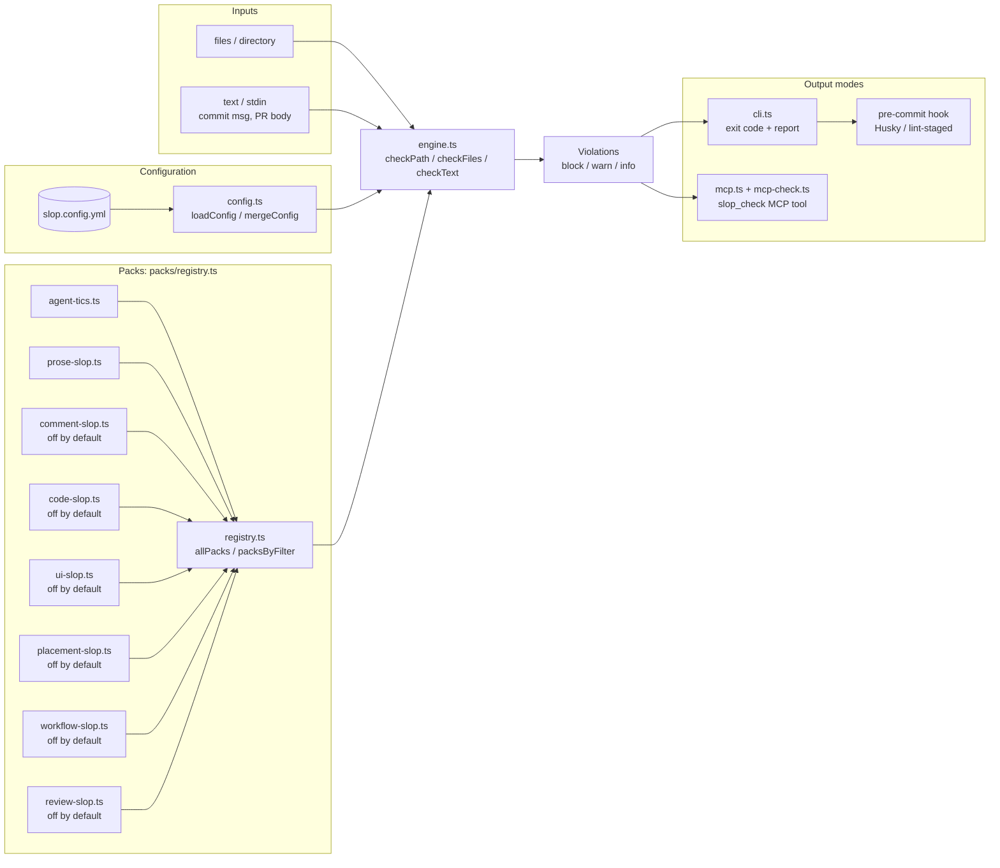

# Integration reference

Sample output, the scan pipeline, pre-commit and CI wiring, the MCP server, exit codes, and the pack roadmap. See the [README](../README.md) for the quick-start commands.

## What a run looks like

```
examples/slop-sample.md
  WARN  3:1    prose-slop/hedging-opener     Hedging opener `It is important to note that`
  WARN  3:40   prose-slop/marketing-adjectives  Empty marketing adjective `cutting-edge`
  WARN  3:121  prose-slop/delve-tapestry     LLM idiom `leverage the power of`
  WARN  7:42   prose-slop/delve-tapestry     LLM idiom `delve into`
  WARN  12:42  prose-slop/em-dash            Em-dash in prose
  WARN  15:1   agent-tics/doubled-summary-heading  Second `Summary` heading
  WARN  19:1   agent-tics/placeholder-todo   Unresolved template placeholder
  WARN  21:1   agent-tics/claude-code-footer Auto-appended Claude Code attribution footer
  ... 12 more

1 files scanned, 20 violations (block 0, warn 20, info 0)
```

`--explain` adds a one-line rationale per violation. Promote any rule to `block` per repo via `slop.config.yml`; the two `agent-tics` rules that catch leaked tool-call XML wrappers (`</result>`, `</invoke>`) ship as `block` by default since those are objectively wrong.

## Scan pipeline

The scan pipeline shows how slop-detector routes input through config and pack selection into the rule engine, then fans out to the three output surfaces.



## Pre-commit recipe (Husky)

```jsonc
// package.json
{
  "scripts": {
    "slop": "slop-detector check .",
  },
  "husky": {
    "hooks": {
      "pre-commit": "npm run slop",
    },
  },
}
```

For a faster, staged-files-only variant pair with [lint-staged](https://github.com/okonet/lint-staged):

```jsonc
{
  "lint-staged": {
    "*.md": "slop-detector check",
  },
}
```

## CI usage

```yaml
- name: Slop check
  run: |
    (cd packages/slop-detector && npm install && npm run build)
    node packages/slop-detector/dist/cli.js check . --format json > slop-report.json
```

A dedicated GitHub Action with PR annotations is planned for M3.

This repository also runs a dedicated `review-guard` CI job. It builds this
package and runs `node packages/slop-detector/dist/cli.js check . --pack
review-slop --config slop.config.yml`; the root config documents the intentional
corpora and examples excluded from that whole-repository check.

## MCP server

slop-detector also ships a stdio [MCP](https://modelcontextprotocol.io) server (`bin`: `slop-detector-mcp`, entry point `dist/mcp.js`), so an agent can scan commit messages, PR bodies, and files as a native tool call instead of shelling out to the CLI.

It exposes one tool, `slop_check`:

| Param        | Type     | Notes                                                              |
| ------------ | -------- | ------------------------------------------------------------------ |
| `text`       | string   | In-memory string to scan. Mutually exclusive with `path`.          |
| `path`       | string   | File or directory to scan. Mutually exclusive with `text`.         |
| `filename`   | string   | Filename assumed for `text` input (prose-vs-code detection).       |
| `packs`      | string[] | Restrict to these packs; off-by-default packs only run when named. |
| `configPath` | string   | Path to a `slop.config.yml` / `.json`.                             |

It returns each violation as `SEVERITY line:col rule message`, grouped by file, plus a one-line tally.

Register it with your runtime by pointing at the built entry point:

```json
{
  "mcpServers": {
    "slop-detector": {
      "command": "node",
      "args": ["/absolute/path/to/slop-detector/dist/mcp.js"]
    }
  }
}
```

Run `npm run build` first so `dist/mcp.js` exists.

## Exit codes

| Code | Meaning                                                                                 |
| ---- | --------------------------------------------------------------------------------------- |
| 0    | No `block`-severity violations. `warn` and `info` are reported but do not fail the run. |
| 1    | At least one `block`-severity violation.                                                |
| 2    | CLI invocation error (missing config, unreadable path).                                 |

## Roadmap

- M1: `agent-tics` + `prose-slop` packs, CLI, config loader, per-line disables.
- M2: `comment-slop` + `code-slop` packs (TypeScript AST via `@typescript-eslint/parser`). Both off by default; opt in via config or `--pack`. Within-file analysis only for all rules except the two experimental cross-file rules (`code-slop/unused-export`, `code-slop/single-callsite-helper`), which require the corpus pre-pass (see [Cross-file rules](configuration.md#cross-file-rules-experimental)).
- M3: `ui-slop` v1 pack with 4 default-on warn rules (gradient text, purple+cyan palette, animated layout properties, skipped heading levels) and 2 default-off info rules (monospace-everywhere, flat type hierarchy). Regex-driven over CSS plus tag-shape scan for headings, no new dependencies. Tailwind class strings, JSX inline `style={{...}}` literals, headless-browser contrast/WCAG rules, GitHub Action wrapper, and LLM-judged rules remain on the M3 backlog.
- `placement-slop`, `workflow-slop`, and `review-slop` shipped after M3; see [CHANGELOG.md](../CHANGELOG.md) for the full version history.

Track progress at [agent-dx](https://github.com/LanNguyenSi/agent-dx) issues and tasks.
